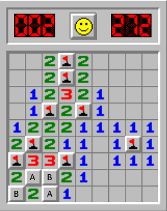
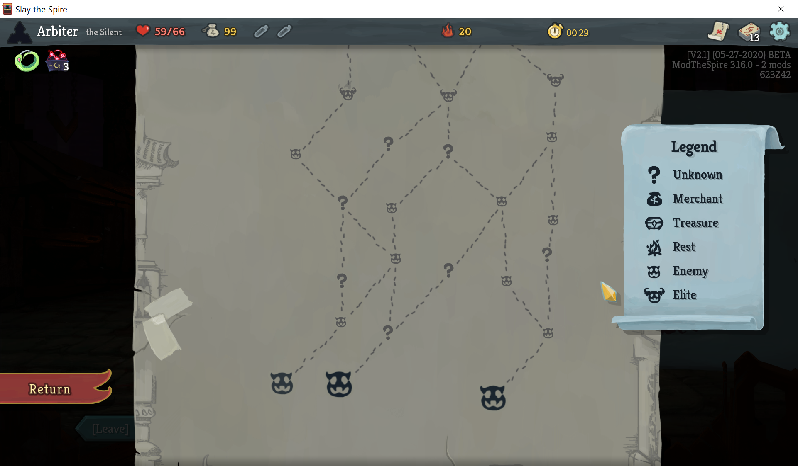
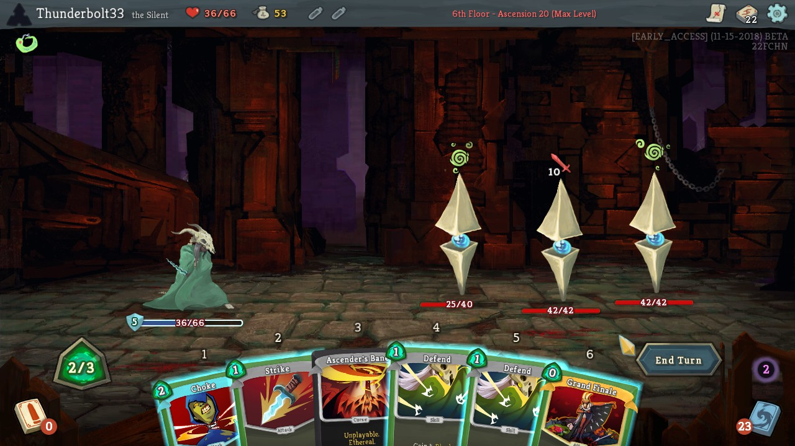
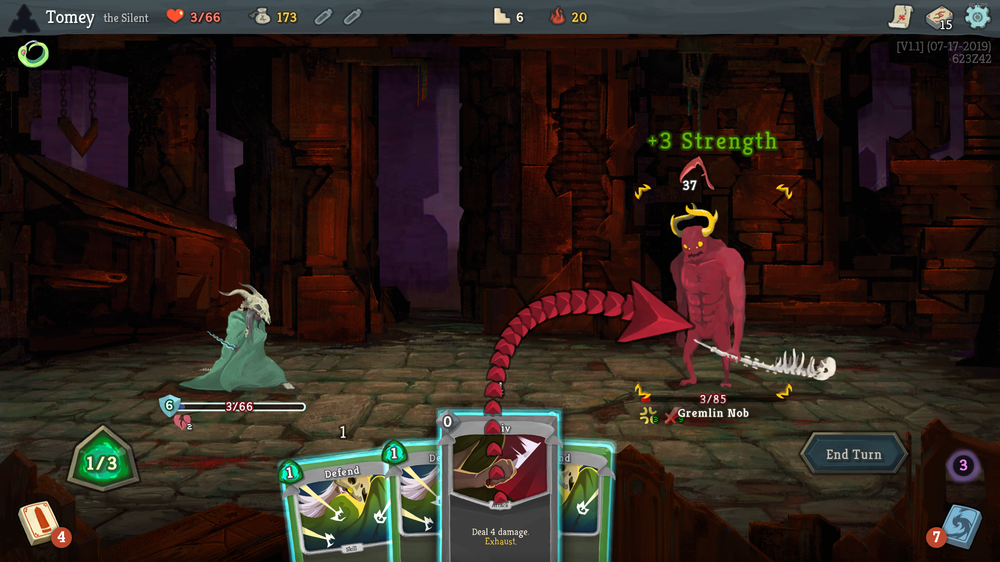

There is a lot of randomness in a game of Slay the Spire. From the cards and relics offered, to the potions dropped, to the map layouts and random encounters, very little remains the same between two playthroughs. This is part of the beauty of the game, forcing you to adapt and make the most out of the resources you have been given in each new attempt. However, with such randomness comes a natural question: can every run of Slay the Spire be won? In this article, I will discuss what I believe to be the current state of knowledge about the answer to this question.

## The two interpretations of the question

Before we begin answering, first there is one detail to get straight: the question of whether every game can be won can actually be interpreted in two different ways. Both are valid and interesting questions, and have very different answers. Here are some more precise formulations of each question:

1. "Can a perfect player win every game of Slay the Spire?" (alternatively, "Is there a strategy that achieves a 100% win rate in Slay the Spire?")
2. "For every *seed* of Slay the Spire, is there a sequence of decisions that results in a win?"

The first question concerns the performance of a player that makes the theoretically optimal decisions at every point in the game to maximize its win rate, given the information available. Generally, there is no computationally feasible way to actually play optimally, so this question is very difficult to answer. However, in many respects, it is the more useful question to a As an example for how to answer this question, however, we may look at another game with heavy randomness: Minesweeper.

Minesweeper is a puzzle game where the objective is to find the hidden locations of mines, using the number of surrounding mines as clues. Despite having simple rules, perfect play is still very difficult to achieve. However, even without knowing how to play perfectly, we can still prove that a perfect player cannot win every game. For example, in the Minesweeper game below, the two remaining mines can either be in the squares marked "A" or the squares marked "B", and a guess must be made. Because such positions are guaranteed to arise in some seeds, not every game of Minesweeper can be won, even following an optimal strategy.

Now, I've used the word *seed* twice, but what does it mean? In a computer game with randomness, a seed is a sequence of letters or numbers which determines all of the randomness in a playthrough. For Minesweeper, this means all the mines are in the same location each time you play a seed. Therefore, each seed is winnable by simply learning which squares do not contain mines. To summarize, for Minesweeper, the answer to our two questions would be:

1. "Can a perfect player win every game?" **No.**
2. "Can every seed be won?" **Yes.**

We can go even further, and refine our answer to question 1, by asking how often a perfect player is expected to win. Again, this question is usually impossible to answer exactly, but because any strategy's win rate is a lower bound for the optimal win rate, we can develop intuition about the answer by analyzing the win rate of players. In particular, for Minesweeper, I found that computer programs have been written to obtain about a [40% win rate](https://www.reddit.com/r/Minesweeper/comments/8my10k/automated_solver_with_high_win_rate/) on Expert difficulty, which means that with perfect play, you can expect to win at least 40% of the time.

For Slay the Spire, however, answering either question is much more difficult, due to the much higher complexity of the game. For this post, I will mostly focus on the second question, of whether a completely impossible seed exists. This is because the existence of an impossible seed is much easier to definitively establish, and if an impossible seed exists, then obviously a perfect player also cannot win on that impossible seed, also answering question 1. However, at the end of the post, I will also provide my thoughts about the win rate of optimal play.

## Randomness in Slay the Spire

Randomness and seeds in Slay the Spire are much more complicated than they are in Minesweeper. However, every random event in a run of Slay the Spire is still determined by the game seed, which can be found on the top right of the screen in-game. Using the same seed and making the same decisions always results in the same outcomes. However, the exact mechanics of the game's randomness are too complicated to cover here. For the purposes of this post, it is sufficient to note that the following things are almost always the same for a seed, no matter what the player does:

* The map layouts
* The order of the normal and elite fights in each act
* The bonuses offered by Neow at the start of the run (for this post I assume there is a Neow bonus)
* The contents of unknown (?) rooms on the map (e.g. the first unknown room is always an event in this seed)
* The enemy AI for a particular encounter (not counting things like splitting slimes)

And these things can often have a fairly small number of different outcomes depending on prior choices in the run (for example, taking a card from Neow may change the card rewards from the first combat node):

* Card rewards
* Potion drops
* The order of events encountered
* Outcomes of events
* Contents of shops

The important takeaway here is that there is only a very limited amount that the player can manipulate their deck, relics, potions, and encounters, especially early in Act 1. This means that there may really be a possibility for a seed having such bad card, relic, and encounter options that it is completely impossible, no matter what the player does.

## What might an unwinnable seed look like?

Since aspects like map layouts, potion drops, events, combats, Neow rewards, and card rewards are mostly static when replaying the same seed, a good starting point is to try to design the worst outcomes for each of these categories, and ask if those outcomes are enough to force the player to lose. For this, we will focus on a particular ruleset of Slay the Spire: Ascension 20 Silent. This choice is made because of the extra difficulty that Silent faces in defeating early elite encounters in Act 1, before the player can tailor their resources towards the specific problems posed by a given seed. In particular:

### Silent cannot kill Lagavulin with the starter deck.

By considering the maximum damage that can be dealt with perfect shuffle luck, it is possible to prove that killing Lagavulin is impossible with Silent's starter deck. She simply cannot deal enough damage before her strength is reduced to -6, and all attacks become ineffective. Let us consider an example fight (Strike=S, Defend=D, Neutralize=N, Survivor=U, Ascender's Bane=B):

| Turn | Strength | Hand    | Discard | Draw    | Played  | Total Damage Dealt |
| ---- | -------- | ------- | ------- | ------- | ------- | ------------------ |
| 1    | 0        | SDDDDUB |         | SSSSDN  |         | 0                  |
| 2    | 0        | SSSND   | DDDDB   | S       | SSSN    | 13 (+21-8)         |
| 3    | 0        | SSSND   |         | SSDDDDU | SSSN    | 34 (+21)           |
| 4    | 0        | SSDDU   | SSSND   | DD      | SSU     | 46 (+12)           |
| 5    | 0        | SSSDD   |         | SSDDDNU | SSS     | 64 (+18)           |
| 6    | -2       | SSDNU   | SSSDD   | DD      | SSNU    | 73 (+9)            |
| 7    | -2       | SSSDD   |         | SSDDDNU | SSS     | 85 (+12)           |
| 8    | -2       | SSDNU   | SSSDD   | DD      | SSN     | 94 (+9)            |
| 9    | -4       | SSSDD   |         | SSDDDNU | SSS     | 100 (+6)           |
| 10   | -4       | SSDNU   | SSSDD   | DD      | SSNU    | 104 (+4)           |
| 11   | -4       | SSSDD   |         | SSDDDNU | SSS     | 110 (+6)           |
| 12   | -6       | All     | cards   | are     | useless | 110                |

Because we can only play 5 strikes and 1 Neutralize per two turns, the maximum damage dealt to Lagavulin turns out to be 110 on Ascension 20, with the starter deck. However, [Lagavulin always has at least 112 HP](https://docs.google.com/spreadsheets/d/1ZsxNXebbELpcCi8N7FVOTNGdX_K9-BRC_LMgx4TORo4/edit#gid=1989923881&range=B84), so victory is impossible.

### The game can force an elite fight on floor 6.

With particularly bad luck, the map generation algorithm can force the player to fight an elite on floor 6, which is the lowest possible floor for elites to spawn. With even more bad luck, the map might not have any shops or rest sites before this forced elite fight. This severely restricts the resources the player can have going into this forced elite fight.

### The Silent might not find any useful cards or potions before floor 6

We already know the Silent cannot kill Lagavulin without additional card rewards, due to a lack of damage in her starting deck. Of course, the Silent will not fight Lagavulin until floor 6, but the game may not actually give any useful resources in this period. For example, here is a set of options from Neow which does not help the Silent deal damage:

1. Remove one card
2. Gain 100 gold
3. Gain 250 gold, lose HP
4. Boss swap (for Black Star)

Due to how potion drops work, even after fighting the maximum of five fights before the first elite, there is a 0.72% chance of still not receiving a potion from any of them. Even if a potion drops, many, such as the Dexterity Potion, do not help the Silent deal more damage.

Finally, there are many Silent cards which do not increase the amount of damage that can be dealt to Lagavulin with the basic deck. Some examples include:

* Deflect
* Outmaneuver
* Piercing Wail
* Accuracy
* Blur
* Concentrate
* Escape Plan
* Footwork
* Reflex

It is entirely possible, though extraordinarily unlikely, to be offered only cards from this list in the first five floors of the game, plus from Neow. Therefore, we have the following theoretical scenario for an unwinnable run:

1. Forced Lagavulin elite fight on floor 6, with no shops or rest sites on the first five floors
2. No Neow bonuses, potion drops, or card rewards which help the player deal damage to Neow

If any seed contains all of these components, then that seed cannot be won (on A20 Silent), no matter what the player does. Therefore, it seems likely that an unwinnable seed exists.

## Finding an unwinnable seed

Now that we have constructed a set of circumstances that produce an unwinnable seed, the natural next step is to find such a seed. Fortunately, a long time ago, I created a [tool](https://github.com/ForgottenArbiter/SeedSearch) for exactly this task. I programmed the search to find seeds with the following parameters:

* A forced floor-6 elite fight with no shops or rest sites below it
* No useful Neow rewards or boss relic swaps
* Not many useful damage cards in the first few card rewards (it was too restrictive to filter for no damage cards whatsoever)
* Four forced monster fights before the elite fight, with the fourth fight being a nasty [hard pool fight](https://docs.google.com/spreadsheets/d/1ZsxNXebbELpcCi8N7FVOTNGdX_K9-BRC_LMgx4TORo4/edit#gid=0&range=A11:A20) (large slime, gremlin gang, exordium thugs, exordium wildlife)

Because the restrictions on potions, damage cards, and even the identity of the elite fight were somewhat relaxed, these seeds were not provably impossible to defeat. To help make up for these relaxed restrictions, I added a requirement for an additional difficult mandatory combat before the first battle. In the end, less than one in 10,000,000 seeds were returned from the search. In order to truly evaluate these seeds, they then had to be manually played through floor 6. I would first attempt the seeds myself, and if I failed to find a way to win in a couple attempts, I would post them as challenges on the Slay the Spire Discord channel. Some readers may have heard about these challenges, which were done twice, once in October of 2019, and once in December of 2018. One of the most difficult seeds from 2018 was finally only solved by taking Grand Finale, but ultimately the entirety of Act 1 was defeated:

And here is one of the harder seeds from the 2019 search:

I expected that some of the seeds I found would never be solved. In reality, I never found an unbeatable seed, despite considering several hundred million seeds. This does not mean none of these hundreds of thousands of seeds are impossible, but it does suggest that unbeatable seeds are extraordinarily rare, at least for Silent on Ascension 20. And although I was only searching for seeds where death was inevitable by floor 6, I believe due to the extraordinary number of ways to play through Act 1, if the boss is reachable on a given seed, the entire seed is probably possible to win, even with a heart kill. If I remember correctly, both of the seeds above were ultimately played to at least an act 1boss kill.

## Does an unwinnable seed probably exist?

There are only $2^{64}$ possible seeds for Slay the Spire, which is about $1.84*10^{19}$, or 18.4 quintillion seeds. If a random event is much more likely than 1 in $2^{64}$, then we may expect a seed to contain that event. If it is much less likely than 1 in $2^{64}$, there is probably no possible seed which contains the event. So, how likely is our scenario for an unwinnable seed? Assuming there's five fights available before the elite and at least four forced normal combats, I calculate a rough upper bound on the no-damage Lagavulin scenario as follows, using some quick estimates of each of the components, through various simulations and calculations:
$$
\begin{equation*}
\underbrace{6.6\times10^{-8}}_{\text{No useful cards}} \times \underbrace{1.3\times10^{-4}}_{\text{Bad map layout}} \times \underbrace{0.0072}_{\text{No potions}} \times \underbrace{0.33}_{\text{Lagavulin}} \times \underbrace{0.6}_{\text{Useless event}} \times \underbrace{0.027}_{\text{Useless Neow}} \approx 3.3 \times 10^{-16}
\end{equation*}
$$

Based on this estimate, I think there is a very high chance that such an unwinnable seed exists, though it may be too rare to actually find an example.

## What is the win rate of an optimal player?

