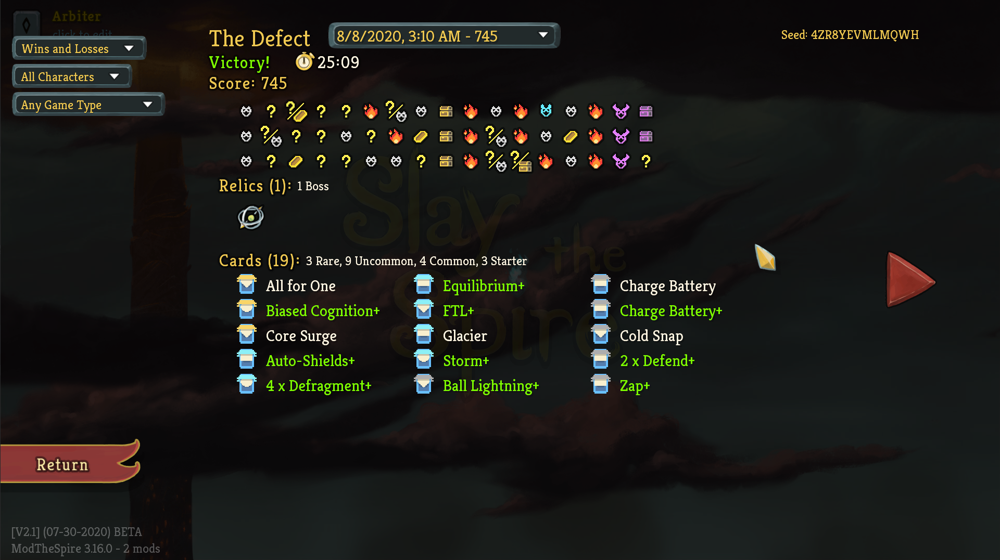

Practically every day, I see people ask for advice on a few of the achievements in Slay the Spire. To avoid having to respond individually to all of these requests, I decided to try to give my thoughts on the most efficient ways to obtain each one. This is a topic I've put some thought into, as one of the few people to run the "all achievements" speedrunning category for this game in the past. Of course, given my background, I will include ways to take advantage of exploits or weird game quirks to more easily set up the achievements. But those will only be mentioned as additional options for those who are interested. For this first post, I will only cover the four challenge run achievements: Who Needs Relics?, Minimalist, Common Sense, and Speed Climber. In future posts, I may discuss some of the other achievements which people often find difficult.

## Who Needs Relics?

This infamous achievement requires the player to defeat the act 3 boss while only having one relic. For many players, it is the hardest of the four challenge runs. Not only is the lack of relics (including boss relics) crippling to the player, but many people struggle with turning off the muscle memory to pick up every relic they see. There is also no way that I know of to truly cheat your way through this achievement. You must simply try until you succeed. Still, there are many things to keep in mind. First and foremost, are a few events that you must be extra wary of:

* Neow: The boss relic swap is a very strong choice, as it tends to make your only relic stronger. It can backfire though. Black Star and Calling Bell in particular are probably worth an immediate restart. But relics like Cursed Key, Snecko Eye, or Pandora's Box can provide a huge advantage.
* Neow: Do NOT accidentally take "Enemies in your next three combats have 1 HP." It will give you a relic. If Neow isn't offering the boss relic trade, you have to take the max HP.
* Mind Bloom: Do NOT take the option to upgrade all your cards in exchange for no healing. It will give you a relic. Usually the correct choice here is the Act 1 boss fight, and then to skip the rare relic when it is offered.
* Golden Idol: Many people accidentally take the idol here. Hopefully this warning will help you remember to skip. On the other hand, Golden Idol is the only relic that can be removed to save the challenge run, using an event in act 3. If you feel extremely lucky, you can hope that event shows up.

To help with the muscle memory issue of automatically picking up relics, here are some suggestions:

* Slow down! Take a few extra seconds in each event and after each fight to remind yourself not to take relics, and about your card choices and how they will be affected by not having any more energy or relics in the future.
* Some people have luck physically taping a reminder to their screens where the relic reward would pop up, telling them not to pick up extra relics.
* (Very minor exploit?) If you accidentally pick up a relic and have not yet progressed to the next floor, head to the options menu, save and quit, and reload your game. This will usually put you back in a state where you no longer have the relic.

And some general advice regarding the challenge:

* If you're very confident in your play or do not have the option to swap, this challenge can be completed fairly consistently with at least Defect and Watcher using the starting relic. Otherwise, swapping relics will usually provide a substantial boost in power.
* I recommend attempting this challenge without ascension mode active. While some people suggest ascension 1 for more rare cards, I find that decks without relic support usually appreciate being able to dodge all elite fights in act 3.
* The biggest challenge here will be late game, so consider taking more early game tradeoffs to make your deck as strong as possible for the end of the game (fewer mediocre damage cards in act 1, removing more cards, etc.). Meta-scaling cards like Feed are also especially good.

### Class choice

I have completed this challenge multiple times on all four classes. Assuming equal skill with all four, I believe the order of difficulty is Silent > Ironclad > Defect > Watcher, with Silent being the most challenging. For most players, I suggest using either Defect or Watcher, depending on their level of comfort with Watcher. However, all of the choices are quite valid.

#### Watcher

Watcher is the class which relies least on having four energy, with many effective energy-generating cards and calm stance. She also scales well without relics and is generally the strongest character in the game. She also tends to punish mistakes more heavily than other characters, so some players will find Defect to be easier. Trading the starting relic is very strong on Watcher, but Watcher also has the strongest upgrade to the starting relic, if you choose to keep it.

#### Defect

When trying to earn all achievements as quickly as possible from a new save file, I would get my first win using Defect, and obtain both Common Sense and Who Needs Relics? in the same run. This can be fairly consistently done with a build featuring Claw, Hologram, Coolheaded, and Charge Battery, with some other commons sprinkled in as needed. If done on a fresh save file, Awakened One will also be the first boss, which is ideal for this strategy.

However, unless you want to round up all the achievements as quickly as possible, there is no reason to restrict yourself to common cards. I recommend orb-oriented builds using card like Biased Cognition, Electrodynamics, Capacitor, Defragment, and Glacier, which do not rely much on relics and scale very effectively into late game. Self Repair can be especially useful for this challenge, given the lack of relics to help with healing and defense. Charge Battery and Turbo are nice common cards to use for extra energy if you do not have access to a 4th energy.

#### Ironclad

I consider Ironclad to be a weaker choice than Watcher or Defect, mostly because Ironclad tends to struggle more when limited to three energy. I recommend taking the boss relic swap on Ironclad if available to try to get 4 energy, even though the starter relic is also quite strong. Without relics, you are likely to take more chip damage throughout the game, so builds which care less about this downside are ideal. My favorite choices are heavy strength gain with Reaper and extremely defensive builds with Barricade. Getting an early copy of Feed can also work wonders, allowing you to survive late game through sheer max HP advantage. Ironclad can take me a few tries to win with, however, if the cards and starting relic do not come together.

#### Silent

Silent is probably the class which relies most on relics. Her large starting deck is somewhat of a liability in the late game, especially if the starter relic is traded away. Her attacks struggle to deal significant damage late game, and she has some difficulty winning without access to 4 energy. When choosing silent for this achievement, I suggest building very defensively, using poison or powers to deal damage. Avoid relying on Shivs, as they tend to require relic support to be successful. It is probably not a good idea to take Concentrate in act 1, like I did in this run:

## Minimalist

Minimalist is another tricky achievement, requiring you to beat the act 3 boss while having at most 5 cards in the your deck. This is best attempted when Neow is offering a card removal, ideally, to remove two cards. Transform effects are also useful, though any resulting cards may still need to be removed later. Still, the achievement can be obtained fairly consistently even without a good Neow offering. Generally, the game plan for this achievement is as follows, and usually doesn't require you to get lucky with Empty Cage or Peace Pipe for extra removals:

* Use any class except Silent, who starts with a larger deck. The achievement can be obtained with Silent, especially if you abuse glitches, but it's much less consistent. Watcher is probably the easiest, and I got 5 minimalist wins in a row with her in testing while writing this post.  Ironclad and Defect are both similar difficulty.
* Play on ascension 1 or 0, whichever you find more comfortable. Relics can be very helpful for some of the weaker Minimalist decks, but act 3 elites, especially Nemesis, can be problematic. Ascension 1 also tends to have fewer events than ascension 0, so card removals may be slightly more scarce.
* Take any card removal option from Neow if available, or gamble for a good transform if it is offered. Otherwise, the chances of getting Minimalist are much lower, but I like swapping for a boss relic to see what I get. Astrolabe, Pandora's Box, and Empty Cage are all very useful swaps, though you would prefer to get Empty Cage later. Taking gold from Neow can also be a good option, as Minimalist runs tend to be tight on gold.
* Take only 2 or 3 cards throughout the entire run. Turn down all others, and make sure the cards you do take are effective in a final five-card deck. More on specific card choices later.
* Maximize shops and events, hoping for card removal events. Don't spend gold on anything except removing cards, unless you are sure you can afford to do so. In act 3, once you have five cards, consider skipping the rest of the events to avoid Falling if it might be catastrophic. If you still need to cut cards from your deck, though, Falling can also be a free card removal.
* Hopefully, you get lucky with the relics and events, and you can win with five cards!
* Technically, the achievement can also be unlocked against the Heart, if you need the act 4 shop to remove a sixth card. However, most five-card decks fare extremely poorly against act 4.

Taking at most 2-3 cards is very important for consistently getting this achievement. Assuming you don't play Silent, you start with 10 cards and need to slim down to 5. Five removals from shops and two from events puts us at 7 card removals, for a total of 5 cards remaining if we only take two cards. This is about the average number of card removals from events and shops that I would expect to see in a run without Empty Cage or Peace Pipe, assuming shops and events are heavily prioritized. Getting to remove a card at Neow makes a big difference (this way you don't need good luck with events or can take an extra card), but is certainly not required. Act 1 in particular has many events that remove cards, so if you head into act 2 with more than 4 cards left to remove, consider restarting the game and hoping for better luck next time.

### Character-specific advice

Ironclad has many useful cards for a Minimalist build. **Searing Blow** is a powerhouse for Minimalist builds. Just watch out for Darklings, who require a way to kill two in one turn. **Body Slam** is a classic choice for Minimalist, as it works well with the starting Defends. Sometimes it is a little bit too slow, however, if you do not find good cards to use with it. Depending on the deck, **Battle Trance** or **Shrug it Off** are good for playing key cards twice, such as **Rampage**, which scales very quickly when played twice each turn. With cards or relics that effectively take advantage of them, **Barricade** and **Demon Form** provide strong ways to win fights, even in small decks. **Whirlwind** is another attack that fits well into many Minimalist strategies. Many players also take advantage of the starting Bash to create a turn-one infinite with two copies of **Dropkick**, or one copy combined with Dual Wield. This can work, but a plan for Time Eater or Donu + Deca may be needed, to deal with the artifact or time maze powers. Here is an example minimalist deck using Rampage as the primary source of damage, with an Evolve to deal with some problematic encounters:

Defect can scale very rapidly with **Claw** and **Coolheaded**. Do not take two copies of Claw, though two copies of Coolheaded are useful to play Claw once for each energy. **Streamline** and **Hologram** are slightly worse common substitutes if Claw and Coolheaded do not show up. Taking these cards is an excellent way to combine Minimalist with the Common Sense achievement. Of course, other cards also go well with this strategy. Anything that draws cards allows for multiple Claws in one turn, and strong defensive cards are also useful. Alternatively, Defect has an effective infinite plan using **Fusion+** and something like **Skim**, plus a zero-cost attack (the starting Zap works well). Generic orb-oriented strategies also work if you can fit them into your limited card picks, especially given relic support like Inserter. Electrodynamics is an especially efficient card. The easiest Defect plan is probably just Claw, though, like in this run:

One of the best cards you can find on Watcher is **Rushdown**. The starting Vigilance and Eruption, each played three or four times per turn using Rushdown, is usually already enough to win the game. Adding **Fear No Evil** or **Inner Peace** on top of Rushdown also allows for turn-one infinite combos, which can help with other achievements. The relics **Snecko Eye** and **Violet Lotus** also allow Rushdown to go infinite with just the starting cards (well, only sort of with Snecko Eye). Even if Rushdown does not show up, Watcher has many options.  I like **Mental Fortress** for 12 block each turn, and **Wallop** for a consistent 24 damage/24 block package for 2 energy. **Signature Move** is easy to make consistent in a minimalist deck, and does enormous damage. **Pressure Points** doesn't synergize with the starting deck, but it can certainly get the job done if you also draft a way to draw cards. The Watcher doesn't need very much from her cards to get a Minimalist win. Here is an example with only Mental Fortress and Just Lucky added (of course, Nilry's helped):

The cards listed are by no means a complete list of good picks for the Minimalist challenge, just some of my favorites. Feel free to try out any combination of cards that show up and seem reasonable in your own runs.

### Pandora's box glitch

Probably the main difficulty in pulling off a minimalist run is removing enough basic cards from the deck. The Pandora's box glitch  makes this much easier, by removing all Strikes and Defends (instead of transforming them, as the game intends). There are several ways to perform this glitch, but the easiest is using the abandon run method, as follows:

1. Pick up Pandora's Box
2. After a screen pops up with your new, transformed cards, click the gear button on the top right to enter the settings screen. Do not click "Confirm" to add the cards to your deck.
3. Click abandon run. A prompt will appear asking whether you really want to abandon the run.
4. Press Escape twice. You should now have the option to "Proceed", without the cards from Pandora's Box.

There is no special timing or practice necessary. If you follow these directions, the glitch should work every time.

## Common Sense

To earn the Common Sense achievement, you need to defeat the act 3 boss while having no uncommon or rare cards in your deck. This wording is very important. If a card has a rarity that is not uncommon or rare, it is allowed to be in your deck. This includes curses, basic cards (Strike, Defend, etc.), and special cards from events (Ritual Dagger, Apparition, etc.). Also, only the final state of your deck matters. If you carry a rare card through most of the game but remove it before the end, the achievement will still unlock. Like Minimalist, it can also be obtained after killing the Corrupt Heart, if Act 4 is needed to remove an uncommon or rare card. This is not usually, done, however, due to the extra difficulty involved.

Like Minimalist, the recommended class for this challenge is any class except Silent. The Silent has few ways to scale her damage and defense using only common cards, so choosing Silent will make the challenge much more difficult. My favorite class to use for Common Sense is Defect. Ascension 1 is often chosen as the difficulty level when attempting Common Sense, due to the extra elites. Ascension 0 is a fine choice as well, though. As a point of warning, beware transform effects, which give non-common cards more often than not.

Similar to Who Needs Relics, the rarity restriction of Common Sense is felt more heavily the longer the game goes on. Therefore, it makes sense to take early tradeoffs which increase your late game power. A thin deck can be a good idea, as it allows you to upgrade most of your cards on lower difficulties. Some cards like **Perfected Strike** like more inflated decks, however. Elite fights should also be prioritized in the early part of the game, to help scale harder through relics, because the available late-game scaling through card choices is lower.

### Ironclad advice

Ironclad has one main card going for him when attempting Common Sense: **Perfected Strike**. The strategy to get the achievement with Perfected Strike is simple: take every copy of Perfected Strike, plus some copies of **Pommel Strike**. If you can get some upgraded copies of **Shrug it Off**, they will help in the few fights that cannot be won immediately. Defends should be removed before Strikes, and getting a 4th energy or a Snecko Eye from a boss relic is very important. The other strikes should be picked in moderation. Even with Perfected Strike, you don't want too many Twin Strikes or Wild Strikes. Sometimes the Perfected Strike build will take a couple tries to come together because Perfected Strike never shows up, but it is one of the most common builds used for Common Sense. You don't need too many Perfected Strikes, either. Here, I only found two copies:

### Defect advice

I already discussed the recommended Common Sense build for the Who Needs Relics achievement and the Minimalist achievement. Basically, you put together a Claw deck. Early on, a copy of **Ball Lightning** does wonders against elites. But you should quickly pick up a few copies of **Claw** and several of **Hologram** to replay the Claws. **Charge Battery** and **Coolheaded** are the main options for defense and card draw, but adding a **Leap** or **Compile Driver** isn't bad either. Really, it's hard to go wrong with most of the common cards. Almost all of them can work in this deck. Don't take too many Claws though, and don't dilute the deck too much. Remember that with a discarded Claw, every copy of Hologram is also potentially another Claw. If Claw never shows up, **Streamline** is an inferior alternative, though Claw and Streamline do not mix well. For a spike of early power, something like **Electrodynamics** can be added to the deck and removed right before the end. Here is an example run which only found one copy of Claw, halfway through act 2. I could usually play it at least 3 times per turn, though:

### Watcher advice

Like Claw in Defect, the most obvious common, self-scaling Watcher card is **Pressure Points**. The damage will stack up very quickly, but you also need a way to block. The Watcher has lots of decent common block cards, so this should not be a big problem. To help with late game scaling, and to play the copies of Pressure Points faster, I recommend a relatively slim deck, with most of the block cards upgraded. Watcher does not need much added to her basic deck to beat the game, after all. Upgraded **Third Eye** is especially insane for filtering through her deck to find the copies of Pressure Points.

Of course, Pressure Points is just one tool for getting Common Sense done with the Watcher, and perhaps not even the most consistent tool. Because Wrath stance already provides enough damage for the Watcher to deal with every threat in the game, building for attack damage is also very effective. **Crush Joints** is a good damage multiplier through Vulnerable, and **Empty Fist** does immense damage when upgraded. **Cut Through Fate** is one of the best common cards in the game, and **Follow-Up** or **Consecrate** do lots of damage without an energy cost. The main problem is that only **Eruption** and **Crescendo** are available to enter Wrath. Having a smaller deck will help, but **Flying Sleeves** can also be used to help guarantee that damage cards are drawn together with an entrance to Wrath stance. Flying Sleeves isn't a very powerful card relative to Watcher's other options, though. Enough copies of Cut Through Fate tend to do a better job. And make sure to pick up a few defensive cards. Again, upgraded **Third Eye** is incredible, and **Evaluate** can be somewhat useful when upgraded as a source of card draw and block if Cut Through Fate isn't showing up. Anyway, if you are comfortable enough playing Watcher, getting Common Sense with her should not be too difficult. Here is an example Common Sense deck that simply used common attack cards in wrath stance. It was capable of dealing over 100 damage per turn, while simultaneously generating significant block:

## Speed Climber

Speed climber, the speedrunning achievement, requires the player to complete a run in under 20 minutes. It is actually possible to consistently beat the game in under 20 minutes with enough practice, but if the goal is just to get the achievement once, I suggest adopting a formulaic mindset that will tend to require a few tries for all the randomness to align correctly. Also, although there are many speedrunning tricks that can slightly improve your speed through the game, they are all unnecessary for earning the achievement. I will cover a few of them, but the vast majority of time saved for most people will come from simply making decisions more quickly, so that should be the focus.

In order to make decisions quickly in game with minimal practice, the best method is to enter each run with a very simple, formulaic plan that minimizes both difficult decisions and turns spent in combat. There are many types of decisions to be made over the course of a run. I will cover card choices last, as they differ by character. But for all characters, here are my common suggestions for gameplay:

* Play on ascension 0 to minimize the number of combats on the map. Ascension 1 is slower than ascension 0.
* Decide before the run what options to take from Neow. If in doubt, a good default is Neow's Lament (first 3 encounters have 1 HP), or the boss relic swap if Neow's Lament is unavailable.
* Before choosing the first node in each act, spend a few seconds looking at the entire map, and try to take a path to minimize the total number of combats (monsters + elites). Given the choice, take a normal fight over an elite fight, as elite fights tend to be much slower. If deciding on a route takes 10 seconds but avoids one extra combat, it is more than worth it.
* Don't spend time making decisions at events. The more you know what option you want to take before the run even starts, the better. However, that tends to come with practice. Some particular events to watch out for are:
  * Council of Ghosts: Usually, you do NOT want to take Apparitions. They will slow you down significantly.
  * Mind Bloom: If you can get away with it (you're not losing tons of HP every fight), upgrading all cards is the fastest option. The extra boss fight will add at least 20 seconds to your run, most likely, if you choose it.
  * Dead Adventurer: Have a plan for how many search attempts you want to risk for the relic. I like once, then leave.
  * Secret Portal: The dreaded event that takes you directly to the act 3 boss can actually be helpful now!
  * Vampires: Remember it will remove all your strikes. So don't take it if you are using Perfected Strikes. It's not great for speedrunning in general, either, so always skipping is a fine plan.
* In fights, don't worry too much about avoiding damage. You can afford to take some damage to end a fight one turn quicker. This is especially true against bosses. Try to kill them before they kill you! It will speed up the entire game, though, especially act 1. On ascension 0, running the builds I will suggest, you can usually get away with blocking little to none in the entire act. If you die, you can just restart. If you're heading into act 3 with lots of time left, you can afford to spend a bit more time being careful.
* Keep in mind a few relics to prioritize buying in shops. For all classes and builds, especially useful options include Bag of Preparation, Juzu Bracelet, Bag of Marbles, and Lantern.
* If none of the cards you want have shown up by the end of act 1, and/or the timer is already above about five minutes, consider restarting. It's better to end the run early than win with a 25-minute victory if the goal is to earn the achievement as quickly as possible.
* This isn't exactly a gameplay tip, but the timer is visible on the top bar of the game on the map screen. Any time the map is open is a good time to check your pace.

### Character-specific advice

Now, finally, I will cover the card choices that I recommend for earning the speedrunning achievement. They represent what I believe to be the easiest and fastest builds to use for each character. All characters are not created equal, however. Ironclad is, in my opinion, the easiest character by far to use to earn speed climber. With enough practice, the Watcher is probably just as fast as the Ironclad, but carries more risk. Ending turns in wrath stance or especially after playing Blasphemy can be disastrous, especially without much time to think or calculate your damage output. Defect can also be very effective, though it cannot win fights as quickly as Ironclad or Watcher. The builds may be less intuitive, as well. Finally, Silent is the slowest option, and not at all recommended for speed climber. Because I don't recommend Silent or Defect for a first attempt at this achievement, I will only provide builds for Ironclad and Watcher.

For the character you choose to use, I recommend memorizing the portraits of the cards I will suggest, and trying to click them on instinct in reward screens and shops. Do not waste time evaluating other cards, but just follow the formulaic card choices to go as fast as possible. Good luck!

#### Ironclad

Ironclad has three main builds I recommend for speed climber. They all are simple to execute, win fights quickly, and you can choose between them depending on which cards are offered on the first few floors. They each generally revolve around one particular damage card: **Whirlwind**, **Perfected Strike**, or **Searing Blow**. This card should be taken, along with a few other key cards I will mention. Avoid adding many other cards to the deck, especially curses, as drawing the key damage combos quickly is important to going as fast as possible. Defends should usually be removed first (though removing strikes isn't too bad with Searing Blow). All the builds generally appreciate copies of **Offering**, **Double Tap**, and **Battle Trance**. They all also can usually use a copy of **Thunderclap** as a cheap way to apply Vulnerable to all enemies. With the right cards and relics, defense should often not be an issue for any of these builds. You will simply kill the enemies too quickly for it to matter. However, if some extra defense is required, try a couple copies of **Impervious**, **Panic Button**, **Shrug it Off**, **Disarm** (for the act 3 bosses), or even **Flame Barrier** or **Rage**, depending on your deck and relics. Don't take too many defensive cards, though. Just a few cards can easily be enough to survive, especially if you also take advantage of your potions.

The Whirlwind build is the fastest, and the build usually used for competitive speedrunning attempts. It revolves around using the **Whirlwind** + **Flex** combo to deal massive damage to every enemy at once. Take at most 2-3 copies of Flex and as many copies of Whirlwind as needed to consistently draw a copy on turn one. **Limit Break** is a great way to dramatically scale strength, especially if it can be drawn multiple times per turn. In act 1, a couple other damage cards can be useful to take, in order to speed up fights before Flex + Whirlwind comes online. Good examples include **Clash**, **Perfected Strike**, and **Sword Boomerang** (with Flex). Make sure to buy Chemical X and Brimstone if they show up in shops, and prioritize energy relics as boss rewards. Late game, a common turn 1 combo might be: Flex, Flex, Offering, Flex, Flex, Double Tap, Thunderclap, Whirlwind. Here is an example deck, which found many of the best possible relics:

If you have the ingredients of the Whirlwind build which give strength but Whirlwind does not show up, try picking up a couple more copies of **Sword Boomerang** or **Heavy Blade**, plus some more strength-gaining cards like **Inflame** or **Spot Weakness**. Especially with Limit Break and a small deck, you can quickly gain enough strength to defeat any enemy. Here is a run that never found a copy of Whirlwind, but still easily won:

If a couple copies of **Perfected Strike** show up in act 1, it may be worth building around Perfected Strike instead of Whirlwind. Take every copy of Perfected Strike offered, plus up to a couple copies each of **Twin Strike** or **Pommel Strike**. **Immolate** and **Whirlwind** can be useful for solving some fights with lots of enemies more quickly. As for relics, getting to 4 energy is a big priority of course, and Pandora's Box is quite bad. Snecko Eye is usually not good for speedrunning due to the extra thought required each turn, but with a deck built around 2-energy attacks, it is rather powerful. The run below followed this rough plan, but didn't find an energy relic at the end of act 1. It was not needed to come in under 20 minutes, but a timely portal event whisked me straight to the final boss in act 3.

Finally, sometimes a copy of **Searing Blow** will show up in the first four to five floors. In this case, going for a build based on Searing Blow can lead to very fast times. When speedrunning with Searing Blow, having a small deck is even more important than usual, since Searing Blow is used for most of the deck's damage. Because Searing Blow provides massive single-target damage but struggles with multiple enemies, a copy of **Immolate** or **Whirlwind** is highly recommended to supplement Searing Blow, even more so than with Perfected Strike. This area of effect card is also a good target for an upgrade, probably the only upgrade not going to Searing Blow itself. Removing Strikes instead of Defends may allow you to save a bit more health, allowing for more upgrades at rest sites. Ultimately, you will probably be able to reach at least Searing Blow+12, for 126 damage. I never found an early Searing Blow in my runs while writing this, so I do not have an example to show.

#### Watcher

Watcher is a little more flexible than Ironclad, and less reliant on one specific card or combination of cards to kill enemies. That being said, the ideal setup is **Blasphemy** + **Wreath of Flame** + **Ragnarok**, for a total of 42 x 6 = 252 damage, enough to defeat many encounters by itself, or at least come close. But Watcher runs will usually start taking a few efficient damage cards to defeat most encounters right after entering Wrath. Some good candidates include **Follow Up**, **Tantrum**, **Crush Joints**, **Consecrate**, **Empty Fist**, and especially **Conclude**. Conclude will end many fights in just one turn from wrath stance. Unfortunately, for the toughest single-target fights, you will need more damage than Conclude can provide by itself. Ragnarok is the best option for late game, but with good enough potions and relics, those Follow Ups and Tantrums may be enough as well. Here is an example Watcher run. It was fortunate enough to find two copies of Ragnarok, and killed the Collector in one turn with the help of a Flex Potion:

### Speedrunning optimizations, tricks, and glitches

There are many little optimizations you can make to your play to go slightly faster. These are simply the ones that I think are likely to make a difference without too much practice. The later ones I will describe are more like exploits, so use your own judgment when deciding whether you are comfortable with employing those sorts of tactics. Keep in mind that the four runs I posted above were glitchless and performed consecutively, on a touch screen, without using the keyboard. They did not require exceptional luck or any special tricks to achieve. The most important aspects of going fast enough for the achievement are making your decisions faster and winning fights more quickly, not the tricks below.

#### Using the map and end turn hotkeys

The most important thing to learn when speedrunning Slay the Spire is use of the hotkeys for map and end turn. Map is set to M by default and end turn is set to E, so these are how I will refer to them. However, many speedrunners choose to rebind the default hotkeys to something more comfortable to them. The use of E is straightforward: use it to end each turn, instead of clicking the button. Ideally, press E just after playing your last card for the turn, during the card's animation, so no time is lost. This will usually save an average player several seconds over the course of a run.

The map hotkey is just as important, but has more uses and can require more practice to implement into normal play. The idea is that once every map node is "completed", the next node can immediately be selected on the map. Pressing M will bring up the map from any screen, removing the need to click most "proceed" or cancel buttons, and even cutting off the time needed to wait for some animations. Most of the time, the map hotkey will be used in the following two situations to save the most time:

* From a card reward screen or combat reward screen, press M to go directly to the map to select the next node
* After using a campfire option, press M to go directly to the map, without waiting for the proceed button to appear (important note: for the smith option, you will need to wait a little while before pressing M. A good audio cue is right after the third hammer strike).

There are other hotkeys that can also be incorporated to potentially save time, but I believe they are not worth learning if the goal is to just get the speed climber achievement. Notably, using number keys to play cards is likely to be slightly faster after enough practice, but most players will not reach that point before getting the achievement, and even at best, compared to fast clicking and dragging of cards, number keys save very little time.

#### Queueing cards and potions

Save as much time as possible in combat by queueing up actions while other animations are completing. If you're fast enough, you can queue your first card to play before the start-of-turn actions are finished resolving, then queue your second card to play before the first card is finished playing, and so on. Potions can also be used before your first cards are drawn in combat or during the enemy turn, and will resolve as soon as possible. Discarding or using unwanted potions during animations in combat can save the time needed to discard them after combat to pick up a replacement.

#### Pandora's box glitch

I already mentioned this glitch earlier and described how to perform it, but the Pandora's Box glitch is extremely powerful for speedrunning. Learn how to perform it, and you can probably speed through the rest of any run that obtains Pandora's Box. It is not so great with a Perfected Strike strategy, though.

#### Abuse save/quit

Did you make a bad decision under time pressure and want to undo it? Or did you just spend two minutes in one fight and want all of that time back? I have good news for you: quitting and reloading resets the game timer to whatever it was when the game was last saved, which is at the start of combat if you quit before the combat ends. By practicing every fight, then reloading and performing the correct actions as quickly as possible, it is fairly straightforward to grind out the speed climber achievement. Note that this is not very helpful for speedrun.com leaderboards, as those are ranked by real time, not in-game time.

#### Put something good in the "Note for Yourself" event

There is an event that allows you to pass trade for a card from one of your past runs. Playing on ascension 0 allows you to encounter this event with some regularity. Putting an especially powerful card into the event can make for some much easier speedruns. It is banned to take advantage of this in runs submitted to the speedrun.com leaderboards, but nothing stops you from doing it for the achievement. It's probably too much effort though to be worth it... unless you descend to depravity and edit your save files to put something really good in, like a Searing Blow+15.