Path of Exile (PoE) is a popular action role-playing game (ARPG) with a huge wealth of different types of content. The underlying mechanics of most content are obfuscated or unknown, requiring experimentation, data collection, and analysis to discover precisely how they work. One type of content in PoE is Harvest. Havest allows players access to the Sacred Grove, where they kill monsters to collect various types of lifeforce. This lifeforce can then be used to craft items. If a player is looking to maximize the amount of lifeforce gained from the Sacred Grove, it is important to understand the underlying mechanics behind monster spawns and lifeforce drops in the Sacred Grove. 

This post will provide a fairly comprehensive picture of how all of this works based on data I have collected myself. First, I will provide a summary of my findings and some ideas for how to use them to optimize your Harvest lifeforce farming, and then I will expand upon my methodology and justify my conclusions. Mechanics of Path of Exile may not be fully explained, so familiarity with the game will be helpful for understanding this post. All of these conclusions are based on data collected in versions 3.19, 3.20, and occasionally 3.22 of PoE (Kalandra, Sanctum, and Ancestor leagues). All mechanics are unfortunately subject to unannounced changes at the whim of the developers.

# Harvest Overview and Definitions

The **Harvest** league mechanic occasionally spawns a portal to the **Sacred Grove** in a map. Each Sacred Grove contains a number of **pairs** of Harvest **crops**, each containing a number of **seeds** (the game also sometimes refers to these pairs of crops as "Harvests", but this is confusing so I will not use this terminology). These seeds are labeled to indicate the **species** and **lifeforce type** (**Vivid**, **Primal**, or **Wild**) of monster which will spawn from each seed. Seeds come in four **seed tiers**, from tier 1 to  tier 4, indicated by the color of the seed's name in the crop's display. Tier 4 monsters are boss monsters and drop the largest amount of lifeforce, while tier 1 monsters are relatively weak and only rarely drop a small amount of lifeforce. When one crop is activated in a pair, the other crop (usually) withers, becoming unavailable. All seeds in the chosen crop then sprout into a number of Harvest **monsters**. When these monsters are killed, they drop up to one stack of **lifeforce** of the type corresponding to their seed. Each type of lifeforce has a corresponding color (**Yellow**, **Blue**, and **Purple**, respectively), which is sometimes used instead to describe the corresponding type of lifeforce.

Many of the governing mechanics of Harvest can be modified by various player choices and map modifiers, including:

* **Einhar's Memory of the Sacred Grove** changes how harvest crops are generated. They no longer appear in pairs, and contain far more seeds with higher average tiers and multiple types of lifeforce.
* **Map Increased Item Quantity (IIQ)** increases the amount of items received in the current map. Map IIQ can be found in the list of map modifiers once you have entered the map, listed as "X% increased quantity of items found in this area."
* **Pack Size** increases the number of monsters in each pack of monsters in the current map. Pack size can be found in the list of map modifier, listed as "X% increased pack size."
* **Map Tier** denotes the difficulty of the current map, from 1 to 16, corresponding to an area level of 68 to 83.
* **Atlas Passives** can be allocated on the player's Atlas Passive Tree to provide various benefits, which will be addressed when they are relevant.

Here is an image of a pair of Harvest crops, for reference:

# Summary 

The following numbers, probabilities, and distributions represent my best guesses based on my data and analysis. To better understand why or to what extent I believe these to be correct, continue reading beyond this summary.

## Generating the Harvest Crops

The following process is used to generate your Harvest crops in each Sacred Grove in a normal map:

1. 3-4 pairs of crops are generated.

   * Both 3 and 4 pairs are equally probable (low confidence).

   * With the Atlas passive of "50% chance to contain an additional Harvest", an extra pair is added 50% of the time, for a total of 3-5 pairs of crops.

2. Each crop chooses a lifeforce type. All three types are equally likely.

   * When using a sextant with "Harvests in your Maps contain at least one Crop of (Type) Plants," each pair of crops instead always contains one crop of that lifeforce type and an additional crop of a random type.
   * With Atlas passives of "Harvest Crops in your Maps have X% reduced chance to grow (Type) Plants," the relative weight of the given type is reduced by the stated amount. For example, with a 45% reduced chance to grow Yellow Plants, the relative weights of the three types become (0.55, 1, 1), and the probability of a crop being Yellow reduces from 1/3 to 0.55/2.55, or approximately 21.6%.

## Generating the Seeds in Each Crop

Next, each crop needs to be filled with seeds. I believe this is done as follows in a normal tier-16 map:

1. A T4 seed is rarely added to the crop (About a 1% chance, which should be increased by the relevant Atlas passive).
2. The number of T3 seeds follows a [binomial distribution](https://en.wikipedia.org/wiki/Binomial_distribution) with n=3 and p=0.25 (i.e. up to three T3 seeds with a 25% chance for each one appearing).
    * With Atlas passives of "Harvest Crops in your Maps have X% increased chance to contain Tier 3 Plants," the value for p is increased by X%.
3. The number of T2 seeds follows a binomial distribution with n=8 and p=0.75.
4. Each crop is then filled up to 23 seeds, with the remaining seeds being T1.
5. The species of seeds for each tier are chosen uniformly at random for the selected lifeforce type. T1 seeds are split across 2 species.

When the map tier is lower, the chance of spawning higher-tier seeds decreases. The mechanics of this are unknown. To the best of my knowledge, the minimum map tier required to encounter T4 seeds is also unknown.

## Spawning Monsters from Seeds

When a crop is activated, each seed sprouts into a number of monsters of the seed's species:

* A T4 seed always spawns exactly one boss monster.
* A T3 seed always spawns at least one monster.
* A T1 (low confidence), T2, or T3 seed has a chance to spawn an additional monster equal to the map's increased pack size.
  * If the pack size is over 100%, then the seed always spawns one additional monster and has a chance of spawning 2 additional monsters equal to the percentage that the pack size exceeds 100%.
* If the Atlas passive "Harvested Plants in Areas have 10% chance to spawn an additional Monster" is allocated, then a T1, T2, or T3 seed has a 10% chance to spawn another additional monster. This is completely separate from the monster that may be spawned from pack size.
* If Atlas passives with "Plants harvested in your Maps have X% chance to spawn Duplicated Monsters" are allocated, then any tier of seed may spawn more monsters, with their own lifeforce drops. The exact interactions between this passive and the previous effects are unknown (these passives were bugged when I collected data in Sanctum league). However, I presume this is effectively an X% more multiplier on average total lifeforce (low confidence).

## Lifeforce Drop Chance from Monsters

When a monster that spawned from a seed is killed, it has a chance of dropping lifeforce, depending on its tier:

* A T4 or T3 seed always drops one stack of lifeforce.
* A T2 seed has a 10% chance to drop one stack of lifeforce.
* A T1 seed has a 2% chance to drop one stack of lifeforce.

If the atlas passive "Lifeforce dropped by Harvest monsters in your maps has 10% chance to be duplicated" is allocated, then every stack of lifeforce has the corresponding chance to be replaced with two identical stacks of lifeforce. This is effectively another 10% more multiplier on average total lifeforce received.

Lifeforce drops are unaffected by reward conversions from archnemesis modifiers. However, in Kirac's Memory of Survivor's Guilt, lifeforce drops are converted to stacks of currency shards.

## Quantity of Lifeforce Dropped

Once lifeforce is determined to have dropped from a monster, first a base amount of lifeforce is determined:

* T4 monster: ~190 to ~280 (average around 225 to 245) (low confidence)
* T3 monster: 37 to 57 (average 47)
* T2 monster: 12 to 25 (average 18.5)
* T1 monster: ~4.5 to 10 (average around 7 to 7.5)

The amount of lifeforce is increased by the "Harvest Monsters in your Maps drop X% increased Quantity of Lifeforce" amount from the Atlas tree, plus half of the map IIQ. The final amount is multiplied by 2 (after any rounding) when using any sextant that doubles lifeforce. All together, the amount of lifeforce dropped from a monster is approximately

$$
\textrm{dropped} = \textrm{base} \times \textrm{mult} \times (1 + \textrm{iiq}/200 + \textrm{increased}/100),
$$

where "base" is a random base amount dependent on the tier of the monster, "mult" is 2 with the doubled lifeforce sextant and 1 otherwise, "iiq" is the map IIQ, and "increased" is the amount of increased quantity of lifeforce on the Atlas tree.

Based on my testing, I have not found evidence that anything else modifies the amount of lifeforce dropped. Some important factors that do not modify the amount of lifeforce include player IIQ/IIR, monster IIQ/IIR, party bonuses, and delirium. Note that IIQ from Eldritch altars adds to map IIQ instead of player IIQ, and therefore does affect lifeforce drops.

## Crop Rotation

The 3.22 patch added a new keystone called "Crop Rotation" that dramatically changes how seeds are generated in Harvest. If Crop Rotation is allocated, then all crops contain 23 T1 seeds of a single color. When a crop is harvested, each seed in each crop of a different color has a chance of independently upgrading its tier, up to T4. The chances of upgrading are as follows (for T16 maps):

* T1 -> T2: 25%
* T2 -> T3: 20% (conflicting evidence exists)
* T3 -> T4: About 2 - 5.5%

There are two important notes regarding these percentages. First, while my data confidently indicates a 20% chance of a T2 to T3 upgrade, lifewithoutpants has also collected [crop rotation data](https://www.youtube.com/watch?v=VzRRmwCnkoc) indicating a probability closer to 25%. I didn't find anything wrong with their procedure, so for now this is a mysterious discrepancy. An independent confirmation from a third party could be helpful to clear this up. Second, the chances of upgrading differ based on map tier. For example, in a T2 map, the chances of upgrading are closer to these (low confidence on the specific percentages due to collecting less data, but high confidence on the percentages being different from T16 maps):

* T1 -> T2: ~19%
* T2 -> T3: ~14%
* T3 -> T4: 0%

## Miscellaneous Notes

* Einhar's Memory of the Sacred Grove does not affect the mechanics of spawning monsters from seeds or dropping lifeforce. It does increase the size of crops to 45-47 seeds, depending on their location in the Sacred Grove. Higher tier seeds also become more likely, but I did not investigate the mechanics behind the distribution of seed tiers in these memories. On average, it seems approximately three Tier-4 seeds will spawn across the four maps of a single memory in T16 maps. As with all memories, all Atlas passives will be disabled.
* Boss monsters from T4 seeds have a small chance of dropping a valuable Sacred Blossom. The drop rate is unknown and may depend on hidden factors or have been adjusted throughout the Lake of Kalandra league. See #TODO HERE
* I did not collect data on the chance of Harvest appearing in a map, but if you trust poedb, the base chance for Harvest is currently 8% and you can use the calculator [here](https://poedb.tw/us/Extra_Content#Extra_Content) to calculate the chance for several different Atlas tree configurations.
* Hopefully someday the devs can fix the bug where Harvest bosses refuse to enter their summoning phase. I find that sometimes it helps to go really far away or leave the Sacred Grove and then come back, but this may just be placebo.

# Data Collection Methodology

The data collected for this analysis can be broken into two main datasets: the Einhar memory dataset and the normal mapping dataset. The Einhar memory dataset was collected manually. I bought six Einhar memories and ran all 24 maps from these memories over two days, keeping track of all relevant information by hand using a spreadsheet. To preserve my sanity, the data collection for the normal mapping dataset was largely automated. A Python script used a combination of manual configuration, optical character recognition (OCR), and log parsing to grab the relvant details directly from the game's output.

## The Einhar Dataset

When rolling each map, I noted in a spreadsheet the map tier, pack size, IIQ, along with some select potentially relevant map modifiers, such as the ones provided by the Einhar memory itself. I made a note of these modifiers before and after corrupting the map, in case the map became unidentified due to corruption. Once in the Sacred Grove, for each crop, I marked down the number of each type of T2 seed, each type of T4 seed, and each species of T3 seed (in case the species mattered). Then, I activated the crop and killed all the monsters. To try to ensure accurate data entry of lifeforce drops, I first entered all lifeforce drops on the screen into the spreadsheet, and then picked them up in the same order, reading them off of the sheet as I picked them up and correcting any errors I encountered during this process. These lifeforce drops were entered as a space-separated list of numbers for each type of lifeforce.

## The Mapping Dataset

A Python script was used to collect information about the current map, crops, and lifeforce drops, adding this information to relevant CSV files as it was collected. Each data collection event (map data, crop data, lifeforce data) was initiated by pressing a different key on my keyboard, which would then take a screenshot from Path of Exile and do any relevant processing. Because the OCR was not perfect, I tried to monitor the values and correct the rare errors I noticed. Each data collection step had a slightly different OCR task, so I will describe how they all work, in case a reader wants to use a similar methodology for their own project. All OCR was done using Tesseract. It was a fun and enlightening weekend project to get it all set up, as I had barely ever touched OCR tools before.

### Collecting Map Data

Before any other data could be collected for a given map, the map data first needed to be updated. First, the map seed, level, and name were collected from the game logs. If the map seed matched the seed of the previously collected map data, then new data was not collected. If no map data existed for the current map seed, data collection for crops would fail and prompt me to collect map data first. This helped to reduce data collection errors, and to ensure less bias in recording data, because the choice to record map data needed to be made before any crops were harvested.

The remaining map data cannot be recovered from the game logs, so I instead used the list of map modifiers that is printed on the right side of the screen when the minimap is moved to the center of the screen. The full procedure for extracting the map modifiers worked as follows:

1. Listen for a keypress of the F4 key
2. Read the logs and check whether map data already exists for the current map (if so, stop here)
3. Grab an image capture of my monitor containing Path of Exile
4. Use template matching to find the little button that appears in the top right of the map modifier box and toggles the visibility of the mods
5. Take a 20-pixel horizontal slice of the screen, right under this button
6. Find the first point where, starting from the x-coordinate of the button on the right, the intensity of this averaged strip changes by around 50%. This is the left side of the map modifier box
7. Do an equivalent procedure to find the bottom side of the map modifier box (take a vertical strip of pixels near the left side of the box and continue downward until the average intensity of the strip changes by around 50%)
8. Crop to the contents of the map mod box
9. Threshold the resulting image at an average RGB value of 140 to get a black and white image
10. Split the image into lines of text. The split is done by finding regions that have a constant value across an entire row (and therefore contain no pixels with text) and splitting in these regions.
11. Feed each line of text into Tesseract to get a text list of map mods
12. Extract the map quantity, rarity, and pack size from this list of map mods (I usually configured the map data collection to fail and need to be re-run if all three were not successfully recovered using OCR)
13. Save all map data (including map name, level, seed, quantity, rarity, pack size, and modifiers)

The Atlas passive tree modifiers and several other potentially relevant stats could not be extracted using this process, so all of these quantities were manually configured before running the script and saved alongside all the other map data. Fortunately, they also rarely changed, so this manual entry was not a large burden.

### Collecting Crop Data

Once the relevant map data was recorded, the next step was to travel to a pair of crops and record all of the seeds for both crops. The full procedure for accomplishing this worked as follows:

1. Listen for a keypress of the F3 key
2. Read the logs and check whether map data already exists for the current map (if not, stop here)
3. Grab an image capture of my monitor containing Path of Exile
4. Use template matching to find the spout icons that appear right under the text box listing all the seeds for each plot (if exactly two spout icons are not found, fail here)
5. Search the space above each spout icon for the background color of the seed text box and crop the image to a bounding box around these points (this method has significant room for improvement because this color can exist elsewhere near the text box)
6. Threshold the remaining image at a minimum R,G,B value of 20,20,20, separating the black background from the text and the vine-styled borders
7. Separate the resulting black and white image into boxes each containing a single line of text, splitting at rows that are constant (these are the vines that separate the boxes of text in the larger text box)
8. Add a pixel of padding to the outside of each box and then flood fill from the outside to eliminate the bordering vines from the box
9. Send each resulting cleaned-up box to Pytesseract to turn it into text
10. Extract the seed species and quantity from the resulting text
11. Match the seed species name to all possible species names and fail if a close-enough match is not found
12. Count up the total number of seeds for each crop and fail if each one does not add up to 23
13. Save all relevant data from both crops, associating it with the current map data
14. Tell the player which crop to harvest first from the pair of crops (the lifeforce that drops will be associated with this crop in the next step)

The same procedure was used for all maps to decide which crop to harvest first from each pair of crops, in order to eliminate the need to enter that data manually and simplify the data collection script. It was a fairly simple heuristic designed to mostly choose the crop with a higher expected value, given that each tier of seed gives overwhelmingly more average resources than each lower tier of seed. Usually, it did succeed in picking the best possible plot:

1. If any crop has a higher tier of seed than appears in the other crop, then pick the crop with the higher tier of seed
2. If both crops have no tier-3 or tier-4 seeds, then pick the crop with the most valuable type of lifeforce
3. If one crop has more tier-3 seeds than the other crop, pick the crop with the most tier-3 seeds
4. If both crops have the same number of tier-3 seeds, then pick the crop with the most valuable type of lifeforce
5. If both crops have the same number of each tier of seeds and the same type of lifeforce, pick the crop furthest to the bottom left of the screen (not that it really matters)

### Collecting Lifeforce Data

Once the crop data was recorded and a crop from the current pair was suggested to harvest, the next step was to harvest that crop and avoid picking up any of the lifeforce that then dropped killing the monsters. The final functionality of the data collection script was to scan the screen for all lifeforce drops, record them, and associate them with the correct crop of seeds. In order for this part of the script to work, I first customized my loot filter to make all lifeforce drops a unique recognizable color, with a black background. Then, the procedure for reading the amounts of lifeforce was rather simple:

1. Listen for a keypress of the F2 key
2. Grab an image capture of my monitor containing Path of Exile
3. Find all regions of the screen with the color that was configured on the loot filter
4. Use `cv2.findContours` and `cv2.contourArea` to find all seperate regions containing this color with a minimum size
5. Grab a bounding rectangle for each of these regions
6. Crop to each rectangle and convert the resulting image to black and white based on whether the color is equal to the loot filter color
7. Feed the resulting black and white image into Tesseract to get a line of text for each lifeforce drop
8. Recover the number and type (Wild, Vivid, Primal) from each line of text
9. Save all data if the number and type is successfully parsed for each line. Otherwise don't save any data and fail
10. Associate the data with the suggested crop from when crop data was collected
11. If both crops are collected from the same pair, then the second time lifeforce data is collected, associate that data with the second crop of the pair

Interesting note: For some colors that can be configured in the loot filter, the chosen color is not exactly the same as the color rendered on screen, but is off by one in at least one of the RGB values in a 100% consistent way. This is probably a mostly unnoticeable cosmetic PoE bug or maybe an issue somewhere else in the rendering or screen capture pipeline, but it did throw me off a bit when trying to get this process to work.

### Final Thoughts About Data Collection

I probably would not have done this entire project at all if I hadn't automated most of the data collection. Even though I only manually dictated the data from 6 Einhar memories, or 24 maps, that already felt so tedious that I couldn't bring myself to continue that sort of data collection. Fortunately, this effort could have application for future projects. For example, if I want to understand the mechanics behind drops from map bosses, then I already have a way to record map data and drops. I just need to configure my loot filter to categorize each relevant type of drop as some particular color, and I should be good to go! I don't know if I will ever do something like that, but the techniques may be useful to anybody else who wants to run a similar project. One bit of advice, though: after collecting most of my data, I discovered that it is possible to change the in-game font. I would suggest doing so, as the default font feels somewhat unfriendly to Tesseract's pretrained OCR models. They especially have a tendency to confuse the 9 and the 0.

Ultimately, the map data that I collected used a very large variety of Atlas tree configurations, numbers of map modifiers, sextants, and other variables that I thought could potentially be relevant. My approach was, for the most part, not to state a hypothesis and then collect only the data required to test that hypothesis, but to collect a huge variety of data and then test various hypotheses and fit various models against the collected data. This approach let me make a large number of reasonable conclusions from only a few hundred maps. When I did collect data to test a single hypothesis, it generally was a hypothesis that could be proven or disproven with a single data point, so the added burden was not too high.

# Data Analysis

Now, finally, it is time to go through the analysis to support the conclusions stated in the earlier sections. I will present a sequence of conclusions build upon each other, followed by the evidence I used to reach each conclusion.

## Axioms

I will not provide direct evidence for the following claims, other than noting that neither I nor any other source that I know of has ever produced a counterexample:

1. Every T3 and T4 seed produces exactly one monster (in the absence of modifiers or pack size)
2. Every T3 and T4 monster drops exactly one stack of lifeforce (unless the stack is duplicated with the relevant small atlas passive)

## Lifeforce Drop Amount and Scaling

Starting with 3.19 data from Einhar memories, I plot the size of every lifeforce drop against the map IIQ, and immediately notice some patterns:

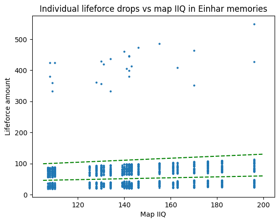

There are three obvious regions to the graph. On top, we have a cloud with all the drops from T4 monsters, and on the bottom we get drops from T2 through T3 monsters (Einhar memories do not have T1 seeds). There is a clear separation in the middle of the bottom portion, which indicates that the T3 drops may not overlap in amount with the T2 drops. The drops are also clearly scaling with map IIQ. The way in which the regions are so cleanly separated by straight lines indicates that the scaling is probably linear, or at least close. I've added some green dotted lines to visually separate everything into three regions in the above plot.

It turns out that if you try to find the best fit for linear scaling, it's remarkably close to a 1% increase per 2% Map IIQ. Because that is such a clean-looking formula and the mechanics were designed by humans, that is a very strong indication that this is indeed how lifeforce drops scale with map IIQ. As a next step, I define **normalized lifeforce drops** for Einhar memories as

$$
\begin{equation*}
\textrm{normalized} = \frac{\textrm{dropped}}{1 + \textrm{iiq}/200}.
\end{equation*}
$$

With this definition, we find as expected that normalized lifeforce has no correlation with map IIQ (T4 drops have been omitted for visual clarity). Furthermore, we can start to visually estimate the base lifeforce drop amounts of about 12-25 for T2 monsters and 37-57 for T3 monsters.

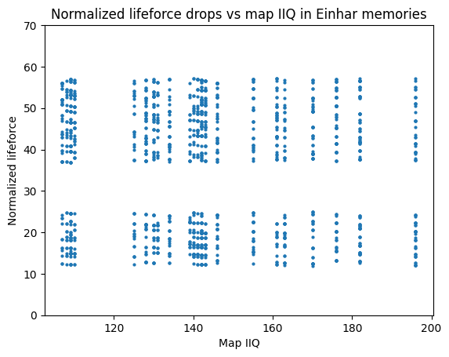

Similarly, examining lifeforce drops outside of memories further indicates that increased lifeforce from the atlas is additive with increased lifeforce from map IIQ. We define **normalized lifeforce drops** in general as

$$
\begin{equation*}
\textrm{normalized} = \frac{\textrm{dropped}}{\textrm{mult} \times (1 + \textrm{iiq}/200 + \textrm{increased}/100)},
\end{equation*}
$$

where again $\textrm{mult}$ is 2 with a double lifeforce sextant and 1 otherwise, where $\textrm{iiq}$ is the map IIQ, and $\textrm{increased}$ is increased lifeforce from atlas passives. We plot normalized lifeforce vs map IIQ for all 3.19 data from non-memory maps:

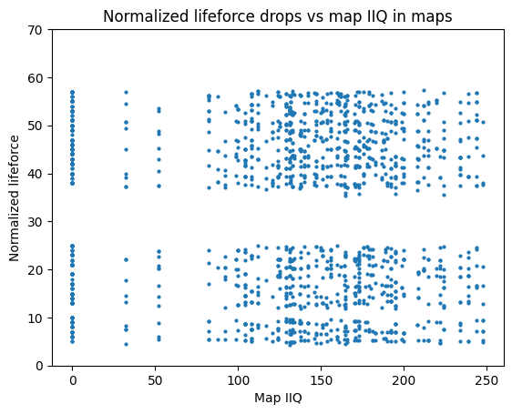

Note that the T3 and T2 lifeforce drops remain in the same location as with the Einhar data. However, now there is a new cluster of points at about 5-10 normalized lifeforce, corresponding to drops from T1 monsters. Although the T1 and T2 clusters are close together, they do not overlap. The entire dataset contains no normalized lifeforce drop between 10.0 and 11.83.

## Base (Normalized) Lifeforce Distribution

Using our discoveries thus far, I can classify every lifeforce drop according to the seed/monster tier that produced it. However, I still do not know precisely how the final distribution of lifeforce values are produced. As a first step, I can look at some distributions of normalized lifeforce across each tier. I start with maps that were run with zero IIQ and zero increased lifeforce on the atlas tree:

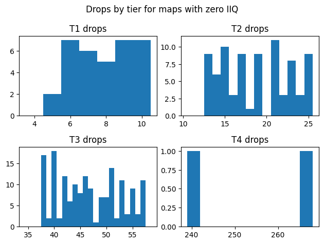

It is immediately apparent that even with zero IIQ, the distribution of lifeforce drops from tier 2 or tier 3 monsters is unlikely to be completely uniform. There is a distinct pattern for T2 and T3 drops where numbers tend to alternate between being more likely and less likely. For example, even T2 drops were much less likely to occur than odd T2 drops. I do not have an explanation for these patterns, which are very unlikely to occur via random chance (for example, even if the probability of an even T2 drop were 60%, the chance of observing at least 65 even drops out of 81 total drops would be just 0.008%).

Ultimately, though, if our goal is to estimate the average amount of lifeforce earned by various strategies, the exact distribution of lifeforce is not important. What I really need is an estimate of the mean normalized lifeforce. So, I use the entirety of our lifeforce data from versions 3.19 and 3.20 to try to estimate this mean:

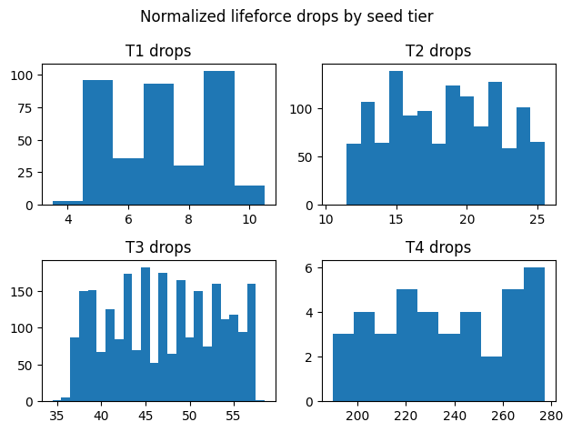

| Tier | Observed Range | Observed Mean  | Estimated Range | Estimated Mean |
|------|----------------|----------------|-----------------|----------------|
| T1   | 4.23 - 10.0    | 7.16 +/- 0.16  | 4.5 - 10        | 7.25           |
| T2   | 11.79 - 25.00  | 18.45 +/- 0.21 | 12 - 25         | 18.5           |
| T3   | 35.38 - 57.50  | 47.11 +/- 0.24 | 37 - 57         | 47.0           |
| T4   | 189.7 - 277.3  | 235.9 +/- 8.6  | 190 - 280       | 235            |

The estimated ranges are chosen to roughly match the observed data assuming a uniform distribution. Generally, the upper limits of each range are quite tight to the maximum drop observed with zero map IIQ, while the lower limits are a bit looser (there are a few normalized T3 drops above 57.0 but the vast majority are below 57.1). This could be an indication that the procedure to generate lifeforce drops involves rounding towards zero as a step, but it is hard to know for sure. In the above table, the mean has been reported with a 95% confidence interval (1.96 times the SEM).

## Pack Size Scaling

Now that we can separate drops into tiers and can estimate the expected size of a lifeforce drop of each tier, it is time to see how pack size affects the number of these drops. We begin with T3 seeds, since their 100% chance to drop a stack of lifeforce makes it relatively easy to see trends and test hypotheses. First, we examine the ratio between the number of T3 lifeforce stacks and the number of T3 seeds, for all 3.19 and 3.20 lifeforce data where the chance of an additional monster from harvest passives was zero:

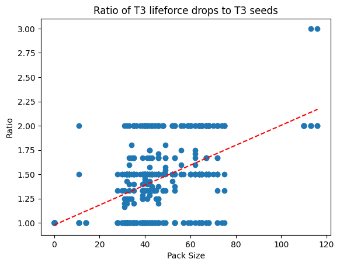

This plot immediately confirms a number of things about the relationship between pack size and number of lifeforce drops. First, we note that when pack size is zero, the number of lifeforce drops always equals the number of seeds. Therefore, nonzero packsize is probably required to spawn additional monsters from a seed. The ratio is always at most 2.0 up to 100 pack size, and can go up to 3.0 with more than 100 pack size. Therefore, at most two monsters can probably spawn from a seed with less than 100 pack size, and three monsters can spawn with more than 100 pack size. Furthermore, fewer than 2 monsters can no longer spawn with more than 100 pack size. Finally, we calculate the linear least square regression, and obtain a best fit (pictured with a red dotted line) of

$$
\begin{equation*}
ratio = 0.01027 \times packsize + 0.97766.
\end{equation*}
$$

If the expected ratio scales linearly with pack size, the above equation should be close to a best estimate for this linear relationship. We obtained an answer that is remarkably close to 1% scaling per pack size. All together, these observations strongly imply that for every percent of increased pack size, the chance of spawning an additional monster from each seed increases by 1%.

Next, we look at T2 seeds, where the picture is slightly murkier:

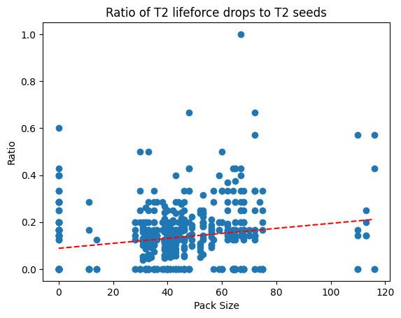

There are no clear thresholds here, but there is a clear correlation still between pack size and ratio. This time, the best fit works out to be

$$
\begin{equation*}
ratio = 0.00106 \times packsize + 0.08823.
\end{equation*}
$$

This is close to a 10% base drop rate, increasing by 1% per pack size as before. However, the numbers are less convincing this time. The mean ratio with a pack size of 0% is 0.107, and if we calculate a normalized ratio by dividing by $(1 + packsize/100)$, then the mean normalized ratio over all pack sizes is 0.093. These numbers also straddle a 10% drop chance. All together, especially since 10% is a nice, round number, I feel the most likely explanation is that T2 drops work like T3 drops, and the expected number of lifeforce drops from a T2 seed increases by 1% (of the base drop rate) per increased pack size, with a base drop rate of 10% per seed.

Finally, we have the T1 seeds:

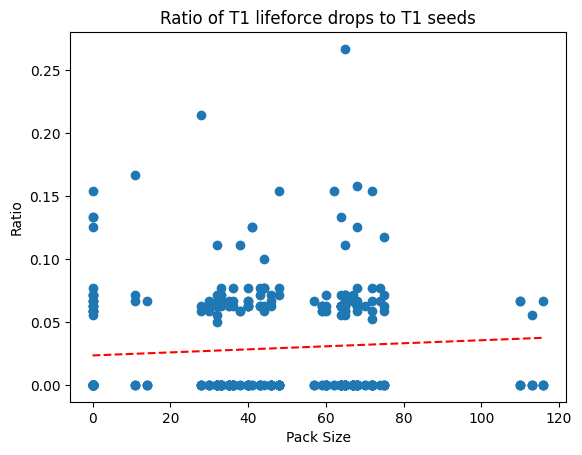

With far fewer data points to work with, it's harder to estimate a drop rate for T1 seeds or even to confirm that the drop rate of T1 seeds actually increases with pack size. However, if we assume an analogous linear relationship and calculate a normalized ratio across all pack sizes, we get a base lifeforce drop rate of 0.017 to 0.023. There is no strong reason for T1 seeds to behave differently from T2 or T3, so I presume that T1 seeds drop lifeforce at a rate of 2% per seed, increased by 1% per pack size.

## Distribution of Seeds in a Plot

The last major unknown I wanted to resolve about harvest was the distribution of the seeds in each plot. How does the game determine the number of T1, T2, T3, and T4 seeds, and how is this process modified by the relevant atlas passives? This time, I will begin my analysis by examining the T2 seed distribution, without any relevant atlas passives allocated. I will also restrict myself to data from tier 16 maps:

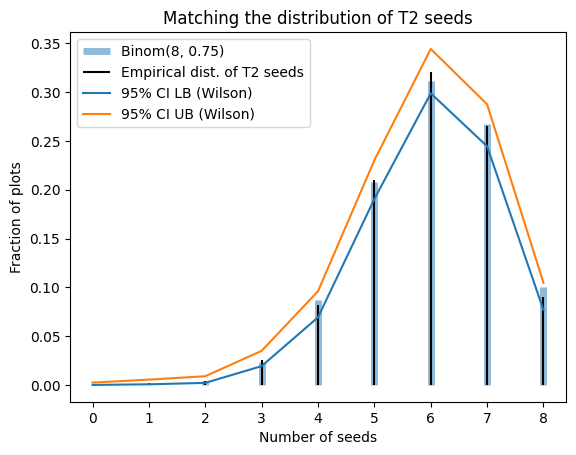

Before examining this data, I had imagined that each of the 23 seeds in a plot would independently roll a tier from tiers 1 through 4. This would lead to the number of T2 seeds being drawn from a binomial distribution with $n=23$. However, looking at the empirical distribution, there is a conspicuous lack of plots with more than 8 T2 seeds, while nearly 10% of plots contain 8 T2 seeds. No binomial distribution with $n > 8$ would fit this empirical distribution and the lack of plots with 9 T2 seeds, so I turned to binomial distributions with $n=8$. The best estimate of $p$ with $n=8$ would then be $\hat{p}=0.746$, which is very close to 75%, a nice and round number that the game designers could have easily chosen. Ultimately, a Binom(8, 0.75) distribution fits the observed data nearly perfectly. For one more sanity check and to check against other possible discrete distributions, I also ran the distribution through the distfit Python package, which also agreed that Binom(8, 0.746) was the most likely underlying distribution for the number of T2 seeds.

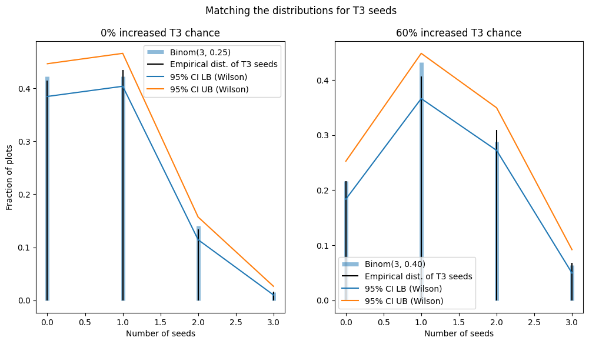

The picture is only a bit more complex in the case of T3 seeds, due to the atlas passive "X% chance of Tier 3 seeds", added in patch 3.20. With 0% increased chance of T3 seeds, the most likely distribution given my data is Binom(3, 0.251). With 60% increased chance of T3 seeds, the most likely distribution is Binom(3, 0.410). Assuming the developers chose nice, round numbers, this means the number of T3 seeds is likely Binom(3, 0.25), with 0.25 increased by 60% to 0.40 with a 60% increased chance of T3 seeds.

Finally, we have the T4 seeds. Unfortunately, these are exceptionally rare, but we can still try to estimate the probability of a T4 seed spawning. I have never heard of a plot containing more than one T4 seed, so I will assume the game includes a T4 seed in a plot with a fixed probability. Without the "Heart of the Grove" atlas notable equipped (which states that it gives a 60% increased chance of a T4 seed), I encountered 7 T4 seeds out of 748 plots. With that notable equipped, I encountered 8 T4 seeds out of 868 plots. Using Wilson 95% confidence intervals, this gives us a 0.45% to 1.92% chance for a T4 seed without Heart of the Grove, or a 0.47% to 1.81% chance for a T4 seed with Heart of the Grove. A 1% base chance for a T4 seed comfortably explains these observations.

All of the above assumed we were in T16 maps. However, in lower-tier maps, the distribution of seeds is different. I collected data from a relatively small number of white maps (area level 70-71) to verify this. Notably, the maximum number of T2 seeds in a plot for these maps was 6 instead of 8. The best fits for the numbers of T2 and T3 seeds were Binom(6, 0.77) and Binom(2, 0.19), respectively. It could be that for lower-tier maps, $p$ remains the same and $n$ decreases for each Binomial distribution, but confirming such a thing would require more data. I also encountered no T4 seeds in white maps, though this by itself is no confirmation that T4 seeds cannot appear in white maps.

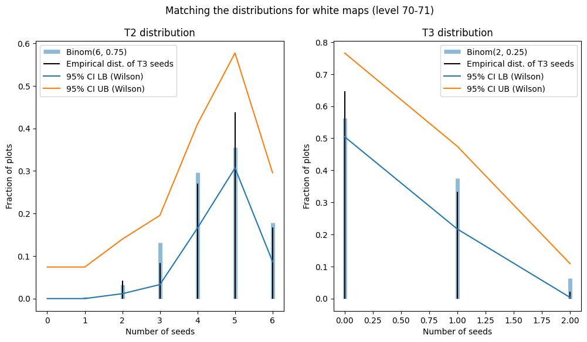

## Number and Type of Plots

First, we would like to answer how many pairs of plots are present in each Sacred Grove. While I reported a base 50% chance of 3 pairs and a 50% chance of 4 pairs, the data is not necessarily 100% conclusive. Without the notable for a 50% chance of an extra pair of crops, I encountered 3 pairs of plots 50 times and 4 pairs of plots 56 times. With the notable, I encountered 3 pairs 40 times, 4 pairs 67 times, and 5 pairs 26 times (30%, 50%, 20%). From my crop rotation data on patch 3.22 with the notable allocated, I encountered 3 pairs 33 times, 4 paris 54 times, and 5 pairs 28 times (29%, 47%, 24%). I came to my conclusion by taking all the data together and assuming the notable works as advertised and the devs did not pick a very strange percentage slightly larger or smaller than 50% for the chance of 3 pairs or 4 pairs.

When the game determines the lifeforce type for each plot, it seems extremely likely that the base weight of each type is equal. Using all map data from versions 3.19 and 3.20, we encountered 435 primal, 413 vivid, and 428 wild plots. It is also possible to allocate atlas passives to reduce the weight of a given lifeforce type. In my 3.22 crop rotation dataset, I always reduced the weight of blue crops by 45%. Theoretically, this should result in relative weights of (0.55, 1, 1), for a 21.6% chance of blue crops and a 39.2% chance of other types. In reality, I observed 212 blue, 364 yellow, and 334 purple plots (23.3%, 40%, 36.7%), which is consistent with what I expected to see.

## Crop Rotation

To evaluate the Crop Rotation atlas keystone (new in version 3.22, after I finished collecting my other data), I needed an entirely new dataset. For this dataset, I collected all data by hand. First, I ran 100 T16 maps using an atlas tree with all Harvest keystones, notables, and small passives equipped except for reduced chance for yellow and purple seeds. No sextants were used. Then, I ran 15 T2 maps with the same setup. For each map, I first noted the number of seeds of each type across all crops. Then, I harvested a crop and noted the number and type of harvested seeds and wilted seeds. Then, I exited/reentered the Sacred Grove (because there is a bug that displays an incorrect number of seeds after harvesting a crop with Crop Rotation allocated) and repeated the process until only one crop pair remained.

From this data, I could calculate the number of seeds that upgraded or failed to upgrade after each crop was harvested. In T16 maps, I had 4615 seeds upgrade from T1 to T2 out of 18410 when eligible, for a 25.1% upgrade rate (Wilson 95% CI 24.4% to 25.7%). T2 seeds upgraded 826 out of a possible 4224 times, for a 20.4% upgrade rate (19.2% to 21.7%). T3 seeds upgraded 16 out of a possible 460 times, for a 3.5% upgrade rate (2.0% to 5.6%). Note that a seed could be eligible to upgrade multiple times in this analysis, if multiple different crops of different types from that seed were harvested.

The upgrade chance was significantly different in T2 maps, even given the lower sample size. In those maps, I had 476/2496 T1 upgrades (17.5% to 20.7% chance), 64/465 T2 upgrades (10.8% to 17.2% chance), and 0/29 T3 upgrades (0 to 11.9% chance). There is precedent for some boss encounters in league mechanics to be restricted to higher-tier maps, so the chance of upgrading T2->T3 may actually be zero for crop rotation in low-tier maps.

## Sacred Blossom Drop Chance

One possible drop from a T4 harvest monster is a Sacred Blossom, a valuable fragment that grants access to the true final boss of Harvest, Oshabi. Based on how other boss drops work in Path of Exile, one might expect the Sacred Blossom to be a deterministic, fixed-probability drop. The natural question then is: what is this probability?

Given the low drop rate of Sacred Blossoms, compounded with the low spawn rate of T4 seeds in Harvest, it would take an enormous amount of maps to get a good estimate. However, I can at least start by aggregating all of my own data:

* In maps in version 3.19 and 3.20, I dropped 1 sacred blossom from 16 T4 monsters.
* In my full Einhar memory dataset (10 memories), I dropped 4 sacred blossoms from 25 T4 monsters.
* I ran another 20 memories in patch 3.19, recording only the number of T4 monsters and number of sacred blossom drops. In these memories, I dropped a total of 2 sacred blossoms from 60 T4 monsters.

All together, in all my relevant data from 3.19 and 3.20, I dropped 7 blossoms from 91 monsters, for a 7.7% drop rate. However, with only 7 total drops, this is insufficient to obtain a very good estimate of the drop rate of a sacred blossom.

To augment this data, I could also look at other Einhar memory samples reported on reddit (these contain far more T4 monsters per hour than any other Harvest farming method). A quick search turned up the following samples that don't have obvious flaws and record all the data I am interested in:

* [3.19 data, from BeltonPOE](https://www.reddit.com/r/pathofexile/comments/ydtwr7/data_collection_from_25x_einhar_memory_of_the/): 25 memories, 75 T4 monsters, 14 sacred blossoms
* [3.19 data, from Justz_duck](https://www.reddit.com/r/pathofexile/comments/ydtwr7/data_collection_from_25x_einhar_memory_of_the/itv1b02/): 30 memories, 77 T4 monsters, 12 sacred blossoms
* [2.22 data, from Blitzilla](https://www.reddit.com/r/pathofexile/comments/16maw3h/results_from_20_einhar_grove_memories/): 20 memories, 55 T4 monsters, 4 sacred blossoms
* [3.23 data, from SnooMuffins1478](https://www.reddit.com/r/pathofexile/comments/1amjnkk/is_einhar_memory_of_the_sacred_grove_worth_doing/kpoo278/): 20 memories, 68 T4 monsters, 7 sacred blossoms

All together, combined with my own harvest memory data, this comes out to 125 harvest memories, with 360 total T4 monsters (2.88 per memory) and 43 sacred blossoms (0.12 per T4 monster). Therefore, if I had to guess the drop rate of sacred blossoms, my best estimate would be around 12% (9-16%). I'm not confident enough to report this as one of my conclusions, though, especially as the data samples span several leagues and multiple potentially unreliable sources.

A big contributor to my lack of confidence is the extreme variability in the harvest memory data. There are two notable outliers: my 20-memory dataset and Belton's 25-memory dataset. In my 20-memory dataset, I had a 3.33% blossom drop rate from 60 bosses, while Belton got a 18.67% blossom drop rate in 75 bosses (and the collection of this data was streamed and predeclared, so it used to be possible to verify, though I only did a quick spot check back then). I collected my data after Belton published his, and I tried to follow exactly the same procedure as him for rolling the maps. However, our results are statistically very different. Maybe there is some weirdness surrounding sacred blossom drops and the drops are not a simple flat chance or the chance was stealth nerfed after Belton's post. Maybe I got extraordinarily unlucky and Belton got extraordinarily lucky. All online datasets (including mine) could be considered untrustworthy, too.

## Reasoning for Miscellaneous Conclusions

There are a bunch of additional details that don't fit neatly into other categories, so I will just briefly state the rest of my conclusions and relevant evidence here.

### Quantity from eldritch altars affects amount of lifeforce dropped

I ran a 0% quantity map, took a significant amount of quantity from eldritch altars, and the stack sizes of dropped lifeforce were inconsistent with 0% area IIQ and consistent with the amount of area IIQ obtained from the altars. The quantity from altars also directly adds to the area IIQ displayed in-map.

### Party bonus does not affect amount of lifeforce dropped

I ran a map with one party member and the quantity of lifeforce dropped covered nearly the entire range expected under a party of one.

### Player IIQ does not affect amount of lifeforce dropped

Several players have dropped lifeforce with -100% player IIQ (which normally suppresses all non-deterministic item drops). I also recorded the amount of player IIQ when collecting my own data, and could not find any correlation between my player IIQ and amount of lifeforce dropped.

### No other map mods not mentioned in this blog post affect amount of lifeforce dropped

It seems almost certain, given that normalized lifeforce drops never leave their expected ranges across hundreds of maps with random map modifiers.

### The 10% chance from Bountiful Harvest is independent of pack size

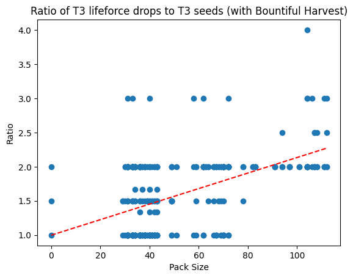

Bountiful Harvest states that "Harvested Plants in your Maps have 10% chance to spawn an additional Monster." With Bountiful Harvest equipped, we can get 3 monsters per seed with less than 40 pack size, or 4 monsters per seed with just over 100 pack size. This would be impossible if the 10% chance were additive or multiplicative with the chance to spawn an additional monster provided by pack size.

### Regarding the chance to spawn duplicated monsters (small atlas passive)

This small atlas passive was bugged when I collected data, so that the duplicated monsters would not drop lifeforce. I have therefore not collected any useful data using this atlas passive yet. However, there are many reports of this passive working to duplicate T4 monsters (to the best of my knowledge, more than one T4 monster has never spawned from a T4 seed without this passive equipped).

### Regarding the chance to duplicate lifeforce (Doubling Season)

Although this small atlas passive was not bugged when I collected data in patch 3.20, I did not collect enough data on this passive to make data-driven conclusions about its precise effect. However, we can still tell a lot from individual observations:

* This is the only effect that can cause a single monster to drop two stacks of lifeforce
* The two stacks always contain an identical amount of lifeforce
* This effect can trigger on lifeforce drops from T4 monsters
* Although the sextant has identical wording ("Lifeforce dropped by Harvest Monsters in your Maps is Duplicated",) the sextant actually has the effect "Harvest Monsters in your Maps drop 100% more lifeforce", and the two effects stack.

## Final Thoughts 

So, with this information, we hopefully have practically everything you need to know to make informed decisions about engaging with Harvest content in Path of Exile, at least up to version 3.22. Still, there do exist some additional questions that could prove useful to answer. Some worthwhile experiments may include:

* Have base amounts of seeds dropped changed in the current patch? This could be answered fairly conclusively in one map by carefully observing the quantity of seeds dropped and comparing these with the predicted numbers.
* Can we better estimate the drop rate of sacred lifeforce? Assuming it is a straightforward percentage chance, we could get a good estimate from a few determined Einhar memory farmers, or anybody using a good source of T4 beasts from future mechanics.
* What is the true upgrade chance from T2 to T3 for crop rotation? So far there are two conflicting experiments on this matter. A third experiment could prove useful to help clarify the matter. Or, someone might shed light on why my results differed so greatly from lifewithoutpants's results.
* For any harvest mechanics that did not exist when this article was written, it would be good to run experiments to divine how they work.

For an example of how this information can be used, consider that given some light assumptions on underlying mechanics and parameters and market prices, we can estimate fairly precisely the average revenue per map of competing farming strategies. For example, here is a plot I made in 3.22 to compare a few possible Atlas setups, showing that the revenue due to Harvest alone was strictly better using Wandering Path:

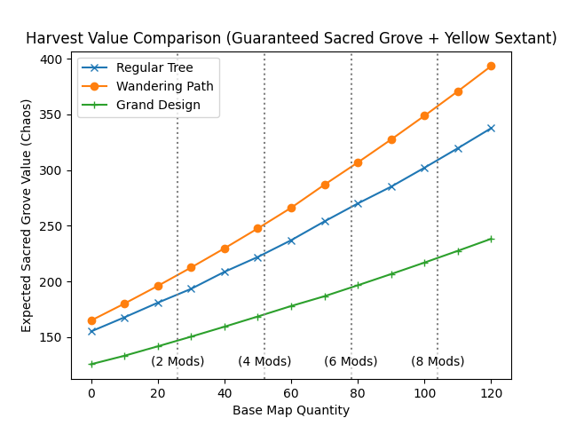

Specific examples from long ago won't be useful anymore, but the tools used to estimate harvest value can be found in the following repository, along with the data and code required to recreate most of the other figures from this post: https://github.com/ForgottenArbiter/HarvestSim 

With luck, this post might inspire others to do some similar analysis for other mechanics which might be amenable to the same sort of thing. For example, if the distribution of essences were to be known along with the exact mechanics of corrupting them and the interactions with the Atlas tree, then it should be a simple matter to compare profitability of Essence farming strategies exactly, without resorting the current favored approach of PoE content creators: run tens or hundreds of maps with each specific strategy.

Anyway, many apologies for how tardy this post is; my interest in PoE has not been as high as it was when I began this project, my pace of writing tends to be very slow, and I kept on finding more things to test. Hopefully, people can still find its contents useful.