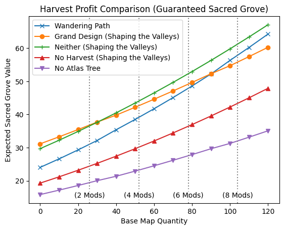

Path of Exile (PoE) is a popular action role-playing game (ARPG) with a huge wealth of different types of content. The underlying mechanics of most content are obfuscated or unknown, requiring experimentation, data collection, and analysis to discover precisely how they work. One type of content in PoE is Harvest. Havest allows players access to the Sacred Grove, where they kill monsters to collect various types of lifeforce. This lifeforce can then be used to craft items. If a player is looking to maximize the amount of lifeforce gained from the Sacred Grove, it is important to understand the underlying mechanics behind monster spawns and lifeforce drops in the Sacred Grove. 

This post will provide a fairly comprehensive picture of how all of this works based on data I have collected myself. First, I will provide a summary of my findings and some ideas for how to use them to optimize your Harvest lifeforce farming, and then I will expand upon my methodology and justify my conclusions. Mechanics of Path of Exile may not be fully explained, so familiarity with the game will be helpful for understanding this post. All of these conclusions are based on data collected in version 3.19 of PoE (Kalandra league). All mechanics are unfortunately subject to unannounced changes at the whim of the developers.

# Harvest Overview and Definitions

The **Harvest** league mechanic occasionally spawns a portal to the **Sacred Grove** in a map. Each Sacred Grove contains a number of **pairs** of Harvest **crops**, each containing a number of **seeds** (the game also sometimes refers to these pairs of crops as "Harvests", but this is confusing so I will not use this terminology). These seeds are labeled to indicate the **species** and **lifeforce type** (**Vivid**, **Primal**, or **Wild**) of monster which will spawn from each seed. Seeds come in four **seed tiers**, from T1 to T4, indicated by the color of the seed's name in the crop's display. Tier 4 monsters are boss monsters and drop the largest amount of lifeforce, while tier 1 monsters are relatively weak and only rarely drop a small amount of lifeforce. When one crop is activated in a pair, the other crop (usually) withers, becoming unavailable. All seeds in the chosen crop then sprout into a number of Harvest **monsters**. When these monsters are killed, they drop up to one stack of **lifeforce** of the type corresponding to their seed.

Many of the governing mechanics of Harvest can be modified by various player choices and map modifiers, including but not limited to:

* **Einhar's Memory of the Sacred Grove** changes how harvest crops are generated. They no longer appear in pairs, and contain far more seeds with higher average tiers and multiple types of lifeforce.
* **Map Increased Item Quantity (IIQ)** increases the amount of items received in the current map. Map IIQ can be found in the list of map modifiers once you have entered the map, listed as "X% increased quantity of items found in this area."
* **Pack Size** increases the number of monsters in each pack of monsters in the current map. Pack size can be found in the list of map modifier, listed as "X% increased pack size."
* **Map Tier** denotes the difficulty of the current map, from 1 to 16, corresponding to an area level of 68 to 83.
* **Atlas Passives** can be allocated on the player's Atlas Passive Tree to provide various benefits, which will be addressed when they are relevant.

Here is an image of a pair of Harvest crops, for reference:


# Summary 

The following numbers, probabilities, and distributions represent my best guesses based on my data and analysis. To better understand why or to what extent I believe these to be correct, continue reading beyond this summary.

## Generating the Harvest Crops

The following process is used to generate your Harvest crops in each Sacred Grove in a normal map:

1. 3-4 pairs of crops are generated.

   * Both 3 and 4 pairs are equally probable (low confidence).

   * With the Atlas passive of "50% chance to contain an additional Harvest", an extra pair is added 50% of the time, for a total of 3-5 pairs of crops.

2. Each crop chooses a lifeforce type. All three types are equally likely.

   * When using a sextant with "Harvests in your Maps contain at least one Crop of [Type] Plants", each pair of crops instead always contains one crop of that lifeforce type and an additional crop of a random type, which may not be chosen uniformly at random.

## Generating the Seeds in Each Crop

Next, each crop needs to be filled with seeds. I believe this is done as follows in a normal tier-16 map:

1. A T4 seed is rarely added to the crop (unknown chance, maybe ~1%, probably increased by the relevant Atlas passive).
2. The number of T3 seeds follows a [binomial distribution](https://en.wikipedia.org/wiki/Binomial_distribution) with n=3 and p=0.25 (i.e. up to three T3 seeds with a 25% chance for each one appearing).
3. The number of T2 seeds follows a binomial distribution with n=8 and p=0.75.
4. Each crop is then filled up to 23 seeds, with the remaining seeds being T1.
5. The species of seeds for each tier are chosen uniformly at random for the selected lifeforce type. T1 seeds are split across 2 species.

When the map tier is lower, the chance of spawning higher-tier seeds decreases. The mechanics of this are unknown.

## Spawning Monsters from Seeds

When a crop is activated, each seed sprouts into a number of monsters of the seed's species:

* A T4 seed always spawns exactly one boss monster.
* A T3 seed always spawns at least one monster.
* A T1 (low confidence), T2, or T3 seed has a chance to spawn an additional monster equal to the map's increased pack size.
  * If the pack size is over 100%, then the seed always spawns one additional monster and has a chance of spawning 2 additional monsters equal to the percentage that the pack size exceeds 100%.
* If the Atlas passive "Harvested Plants in Areas have 10% chance to spawn an additional Monster" is allocated, then a T1, T2, or T3 seed has a 10% chance to spawn another additional monster. This is completely separate from the monster that may be spawned from pack size.

## Lifeforce Drop Chance from Monsters

When a monster that spawned from a seed is killed, it has a chance of dropping lifeforce, depending on its tier:

* A T4 or T3 seed always drops one stack of lifeforce.
* A T2 seed has a 10% chance to drop one stack of lifeforce.
* A T1 seed has a 2% chance to drop one stack of lifeforce.

Lifeforce drops are unaffected by reward conversions from archnemesis modifiers.

## Quantity of Lifeforce Dropped

Once lifeforce is determined to have dropped from a monster, first a base amount of lifeforce is determined:

* T4 monster: ~190 to ~280 (average around 230 to 245) (low confidence)
* T3 monster: 37 to 57 (average 47)
* T2 monster: 12 to 25 (average 18.5)
* T1 monster: ~4.5 to 10 (average around 7 to 7.5)

The amount of lifeforce is increased by the "Harvest Monsters in your Maps drop X% increased Quantity of Lifeforce" amount from the Atlas tree, plus half of the map IIQ. The final amount is multiplied by 2 (after any rounding) when using any sextant that doubles lifeforce. All together, the amount of lifeforce dropped from a monster is approximately
$$
\textrm{dropped} = \textrm{base} \times \textrm{mult} \times (1 + \textrm{iiq}/200 + \textrm{increased}/100),
$$
where "base" is a random base amount dependent on the tier of the monster, "mult" is 2 with the doubled lifeforce sextant and 1 otherwise, "iiq" is the map IIQ, and "increased" is the amount of increased quantity of lifeforce on the Atlas tree.

Based on my testing, I have not found evidence that anything else modifies the amount of lifeforce dropped. Some important things that do not modify the amount of lifeforce include player IIQ/IIR, monster IIQ/IIR, and delirium. Note that IIQ from Eldritch altars adds to map IIQ instead of player IIQ, and therefore does affect lifeforce drops. I have not been able to test party bonuses, but have heard reports that they do not afffect lifeforce drops.

## Miscellaneous Notes

* Einhar's Memory of the Sacred Grove does not affect the mechanics of spawning monsters from seeds or dropping lifeforce. It does increase the size of crops to 45-47 seeds, depending on their location in the Sacred Grove. Higher tier seeds also become more likely, but the specific mechanics behind this are unknown. On average, approximately three Tier-4 seeds will spawn across the four maps of a single memory. As with all memories, all Atlas passives will be disabled.
* Boss monsters from T4 seeds have a small chance of dropping a valuable Sacred Blossom. The drop rate is unknown and may depend on hidden factors or have been adjusted throughout the Lake of Kalandra league. See #TODO HERE
* I did not collect data on the chance of Harvest appearing in a map, but if you trust poedb, the base chance for Harvest is 8% and you can use the calculator [here](https://poedb.tw/us/Extra_Content#Extra_Content) to calculate the chance for any Atlas tree configuration.
* Hopefully someday the devs can fix the bug where Harvest bosses never enter their summoning phase. I find that sometimes it helps to go really far away or leave the Sacred Grove and then come back, but this may just be placebo.

# Optimal Harvest Farming

Now that we understand most of the mechanics behind lifeforce drops, we can more precisely answer questions about optimal lifeforce farming techniques. For the calculations in this section, we will need to set prices for lifeforce and make assumptions about mechanics where we are uncertain about the truth. To use this analysis for one's own use, these prices should be adjusted to reflect the current economy. For now, assume that the prices of Vivid, Wild, and Primal lifeforce are 1/15 chaos, 1/30 chaos, and 1/40 chaos, respectively (this is somewhat lower than the real prices for much of Kalandra league). The mean base lifeforce from a T4 monster is assumed to be 235, the mean base lifeforce from a T1 monster is assumed to be 7.25, and the base chance to spawn a T4 seed is assumed to be 1%. With these assumptions, we are ready to calculate the value of a Sacred Grove and use these calculations to compare strategies.

## Calculating Expected Harvest Value

The first step is to get the distribution of lifeforce drops. For each possible configuration of seeds in the crop, we can calculate the probability of that configuration, along with the expected amount of lifeforce gained by harvesting that crop. An example implementation is in `get_crop_lifeforce_distribution` below, which returns a probability distribution in the form of two arrays, containing the possible amounts of lifeforce dropped and the probability of each amount of lifeforce. The relevant mechanics from the previous section have been hardcoded, with some assumptions where data is insufficient to be confident about the numbers. Notably, I am assuming a 1% base chance for each crop to contain a T4 seed.

```python
from collections import defaultdict
import functools
from dataclasses import dataclass
import scipy
import matplotlib.pyplot as plt

@dataclass
class SeedTier:
    base_drop: float
    drop_chance: float
    is_boss: bool
    distribution: scipy.stats.rv_discrete
    support: list

def get_expected_lifeforce(num_seeds, seed_tier, map_iiq, increased_lf, pack_size, bonus_monster):
    if not seed_tier.is_boss:
        expected_monsters = num_seeds * (1 + pack_size / 100 + bonus_monster / 100)
    else:
        expected_monsters = num_seeds
    lifeforce_per_monster = seed_tier.base_drop * seed_tier.drop_chance * (1 + map_iiq / 200 + increased_lf / 100)
    return lifeforce_per_monster * expected_monsters

def get_crop_lifeforce_distribution(map_iiq, increased_t4_chance, increased_lifeforce, pack_size, bonus_monster_chance):
    t4 = SeedTier(235.0, 1.0, True, scipy.stats.bernoulli(0.01 * (1 + increased_t4_chance / 100)), list(range(2)))
    t3 = SeedTier(47.0, 1.0, False, scipy.stats.binom(3, 0.25), list(range(4)))
    t2 = SeedTier(18.5, 0.1, False, scipy.stats.binom(8, 0.75), list(range(9)))
    t1 = SeedTier(7.25, 0.02, False, None, list(range(24)))
    
    all_seed_supports = (t4.support, t3.support, t2.support)
    lifeforce_probability_dict = defaultdict(int)
    for t4_seeds, t3_seeds, t2_seeds in itertools.product(*all_seed_supports):
        t1_seeds = 23 - (t4_seeds + t3_seeds + t2_seeds)
        probability = t4.distribution.pmf(t4_seeds) * t3.distribution.pmf(t3_seeds) * t2.distribution.pmf(t2_seeds)
        expected_lifeforce = 0
        for num_seeds, tier in [(t4_seeds, t4), (t3_seeds, t3), (t2_seeds, t2), (t1_seeds, t1)]:
            expected_lifeforce += get_expected_lifeforce(num_seeds, tier, map_iiq, increased_lifeforce, 
                                                         pack_size, bonus_monster_chance)
        lifeforce_probability_dict[expected_lifeforce] += probability
    
    support_probability_pairs = sorted(lifeforce_probability_dict.items())
    lifeforce_support, lifeforce_probabilities = zip(*support_probability_pairs)
    return np.array(lifeforce_support), np.array(lifeforce_probabilities)
```

Next, we can calculate the distribution of lifeforce values, in chaos orbs. The following function takes in the output of `get_crop_lifeforce_distribution`, along with the value of each type of non-sacred lifeforce, and returns the distribution of the value of each crop, in chaos orbs:

```python
def get_value_distribution(support, probabilities, vivid_value, wild_value, primal_value):
    vivid_support = support * vivid_value
    wild_support = support * wild_value
    primal_support = support * primal_value
    total_support = np.concatenate([vivid_support, wild_support, primal_support])
    total_probabilities = np.tile(probabilities, 3)
    total_probabilities /= np.sum(total_probabilities)
    new_order = np.argsort(total_support)
    return total_support[new_order], total_probabilities[new_order]
```

Finally, we calculate the expected value of a pair of crops.  We assume that we prefer the crop with the highest expected value, so we need to calculate the maximum expected value of two identically distributed crops. However, with the appropriate Atlas passive, sometimes the lower-valued crop will not wilt, so we instead gain twice the expected value of a crop:

```python
def get_crop_pair_value(value_support, value_probabilities, no_wither_chance):
    value_cdf = np.cumsum(value_probabilities)
    max_value_cdf = value_cdf * value_cdf
    max_value_pmf = np.diff(max_value_cdf, prepend=0)
    expected_crop_value = np.dot(value_support, value_probabilities)
    expected_max_value = np.dot(value_support, max_value_pmf)
    total_value = (no_wither_chance / 100) * expected_crop_value * 2 + (1 - no_wither_chance / 100) * expected_max_value
    return total_value
```

Finally, we multiply this value by the expected number of crops in a sacred grove:

```python
def get_sacred_grove_value(crop_pair_value, extra_harvest_chance):
    mean_crop_pairs = 3.5 + extra_harvest_chance / 100
    return mean_crop_pairs * crop_pair_value
```

In order to compare various Atlas trees, we need to be able to estimate their relative quantities of map IIQ and pack size. To do this, I define "base map quantity" to be the map quantity provided by the map modifiers alone, not including any additional quantity conferred by other sources such as map quality and Atlas tree passives. All map modifiers add a fixed amount of IIQ and pack size. Although the ratio is not the same for all modifiers, it is a decent enough approximation to say that the pack size from map mods is approximately equal to the IIQ divided by 2.6. Therefore, putting everything together, we estimate the expected value of lifeforce in a map as follows:

```python
def get_map_stats(base_map_quantity, bonus_quantity, bonus_pack_size, atlas_modifier_multiplier):
    map_iiq = base_map_quantity * atlas_modifier_multiplier + bonus_quantity
    pack_size = round(base_map_quantity * atlas_modifier_multiplier / 2.6) + bonus_pack_size
    return map_iiq, pack_size

def get_overall_map_value(map_quantity, bonus_quantity=20, bonus_pack_size=0, map_modifier_multiplier=1.0, 
                          increased_lifeforce=0, bonus_monster_chance=0, no_wither_chance=0, extra_harvest_chance=0, 
                          harvest_spawn_chance=8, increased_t4_chance = 0,
                          vivid_value=1/10, wild_value=1/30, primal_value=1/40):
    map_iiq, pack_size = get_map_stats(map_quantity, bonus_quantity, bonus_pack_size, map_modifier_multiplier)
    support, probabilities = get_crop_lifeforce_distribution(map_iiq, increased_t4_chance, 
                                                             increased_lifeforce, pack_size, bonus_monster_chance)
    values, value_probabilities = get_value_distribution(support, probabilities, vivid_value, wild_value, primal_value)
    crop_pair_value = get_crop_pair_value(values, value_probabilities, no_wither_chance)
    sacred_grove_value = get_sacred_grove_value(crop_pair_value, extra_harvest_chance)
    return sacred_grove_value * harvest_spawn_chance / 100
```

## Comparing Farming Strategies

Now, we can finally use all of this to compare different strategies for Harvest lifeforce farming. First, we will start by comparing some atlas trees, purely based on profit per Sacred Grove, assuming we encounter the Sacred Grove every map (for example, if Harvest is forced using a sextant):

1. An Atlas tree using Wandering Path (WP), taking all small Harvest, map IIQ, and map modifier effect nodes
2. An Atlas tree using Grand Design (GD), taking 40 notables including all Harvest notables, plus Shaping the Valleys
3. An Atlas tree using neither WP nor GD, taking all Harvest, map IIQ, and map modifier effect nodes, plus Shaping the Valleys
4. An Atlas tree taking no Harvest nodes, but all map IIQ, map modifier effect nodes, and Shaping the Valleys
5. No Atlas tree bonuses

For each of these, we will assume that all maps are chiseled to 20% quality and run with Fortune Favors the Brave on the map device. Then, the expected value of a Sacred Grove can be found in the following chart (approximate map quantity values for various numbers of map mods are marked with dotted lines):



Based on this, Grand Design is best for scoured maps but "Neither" pulls ahead of Grand Design well before the investment level of "alch and go" (4-5 map mods on average). Wandering Path starts to become more competitive with higher numbers of map mods, though it fails to ever catch up to an Atlas tree without Wandering Path. The profit from each Sacred Grove increases dramatically with relevant investment. The "No Harvest" Atlas tree already gives significantly more value than having no Atlas tree at all. Taking all Harvest nodes on top of that provides about another 50% increase.

However, this comparison is not necessarily fair to Wandering Path, as a player may not want to run Fortune Favors the Brave, and Wandering Path trees cannot use Shaping the Valleys to receive extra benefit from Fortune Favors the Brave. If we remove Shaping the Valleys from all of our Atlas passive trees, the picture changes:


Now, all three Atlas strategies are close to each other at "alch and go" investment, with Grand Design still trailing. With Shaping the Valleys out of the picture, Wandering Path is able to pull ahead around 90-100 map quantity. However, this doesn't mean all these Atlas strategies are created equal. In reality, Harvest is not guaranteed, and each Atlas strategy has a very different chance of spawning a Sacred Grove. Unfortunately, to account for this requires making significantly more assumptions. But just to give one example, assume:

1. Wandering Path only has the small passive Atlas nodes to increase the chance of Harvest, for a total of 20% chance to encounter a Sacred Grove
2. Grand Design blocks all league mechanics except Harvest and takes all Harvest nodes, for a total of 30% chance to encounter a Sacred Grove (though in practice, the notable to increase the chance of encountering a Sacred Grove is fairly inefficient, usually requiring 6 points)
3. The "Neither" Atlas tree blocks 5 league mechanics and takes all Harvest nodes, for a total of 28% chance to encounter a Sacred Grove
4. The "No Harvest" Atlas tree blocks 5 league mechanics and takes no Harvest nodes, for a total of 18% chance to encounter a Sacred Grove
5. Without an Atlas tree, you have an 8% chance to encounter a Sacred Grove

Now, the average profit per map can be calculated:


We can see that the ability to block other league mechanics gives a huge advantage to the specialized non-Wandering Path Atlas trees, which have dramatically higher profit per map. These sorts of plots can also allow us to mathematically compare investment in Harvest to investment in other areas of the Atlas tree. For example, without Shaping the Valleys, the difference between the "Neither" tree and the "No Harvest" tree is an investment of around 19 points, and increases the average returns by 6.67 chaos per map at 60 map quantity, for a total return of 0.35 chaos per point per map.

Most Atlas investments cannot be directly compared in value so easily, but one easy example in the Kalandra league is the "Etched by Acid" notable, which states "Your Maps have 10% chance to award double progress towards encountering The Eater of Worlds" and requires 4 points to allocate. If an Eater of Worlds invitation costs 100 chaos and takes 28 maps to obtain, then this notable's value per map is approximately 0.1 * 100 / 28 = 0.71 chaos, so because taking "Etched by Acid" requires 4 passive points, it returns approximately 0.18 chaos per point per map. In this case, our Harvest passives are a more efficient use of Atlas points.

Another use for these plots could be to decide whether it is worth buying a sextant to guarantee Harvest in your maps. As an extreme (though simplified and somewhat flawed) example, if you have a set of four 8-mod corrupted maps with 100 base map quantity and you are using the Wandering Path Atlas tree, then the sextant provides an average of 45 chaos per map, and provides profit on average as long as it costs less than 180 chaos (for 4 uses). You could increase profit even further by using a double lifeforce sextant.

## Comparing the Double Lifeforce Sextants

Path of Exile has three of these sextant enchantments that double the lifeforce dropped from monsters. These sextants each also guarantee that one crop in each pair of crops has a certain lifeforce type, depending on the sextant: Vivid, Primal, or Wild. Naturally, depending on the prices of lifeforce, these sextants, and your chosen farming method, one of these sextants will be the most cost-effective choice. Which one is it? We can do some new expected value calculations to try to answer this question.

Unfortunately, the guaranteed crop means that our calculations to find a plot value need to get more complicated. I need to write some code to find the maximum of two independent, non-identically-distributed random variables and plug in the value distributions for the guaranteed crop and the random-typed crop. Here, I am assuming that the non-guaranteed crop has an equal chance of being each type of lifeforce:

```python
def distribute_cdf_to_new_support(old_support, new_support, old_cdf):
    old_index = 0
    old_value = old_support[0]
    old_prob = 0
    new_cdf = np.zeros_like(new_support, dtype=old_cdf.dtype)
    for new_index, new_value in enumerate(new_support):
        while new_value >= old_value:
            old_index += 1
            if old_index >= len(old_support):
                old_value = np.inf
                old_prob = 1
            else:
                old_value = old_support[old_index]
                old_prob = old_cdf[old_index - 1]
        new_cdf[new_index] = old_prob
    return new_cdf

def get_max_pmf(support_1, support_2, pmf_1, pmf_2):
    combined_support = np.array(sorted(set(support_1).union(set(support_2))))
    cdf_1 = np.cumsum(pmf_1)
    cdf_2 = np.cumsum(pmf_2)
    cdf_1 = distribute_cdf_to_new_support(support_1, combined_support, cdf_1)
    cdf_2 = distribute_cdf_to_new_support(support_2, combined_support, cdf_2)
    max_cdf = cdf_1 * cdf_2
    max_pmf = np.diff(max_cdf, prepend=0)
    return combined_support, max_pmf

def get_sextant_crop_pair_value(lifeforce_support, lifeforce_probabilities, value_support, value_probabilities,
                                no_wither_chance, sextant_lifeforce_value):
    guaranteed_support = lifeforce_support * sextant_lifeforce_value  # For the crop of the guaranteed type
    max_support, max_pmf = get_max_pmf(guaranteed_support, value_support, lifeforce_probabilities, value_probabilities)
    expected_max_value = np.dot(max_support, max_pmf)
    expected_crop1_value = np.dot(guaranteed_support, lifeforce_probabilities)
    expected_crop2_value = np.dot(value_support, value_probabilities)
    expected_combined_value = expected_crop1_value + expected_crop2_value
    total_value = (no_wither_chance / 100) * expected_combined_value + (1 - no_wither_chance / 100) * expected_max_value
    total_value *= 2  # Double lifeforce from the sextant
    return total_value
```

After incorporating this back into `get_overall_map_value`, we can compare the value of all the different sextants to a baseline without sextants. The plot below shows such a comparison, using the Atlas tree with Shaping the Valleys and neither WP nor GD. As you can see, when the value of one type of lifeforce is much higher than the value of other types, there is a huge advantage to using the sextant to guarantee that type of lifeforce. Here the value of Vivid lifeforce is assumed to be 3-4 times higher than the value of the other types of lifeforce, and the Vivid lifeforce sextant produces over 3 times as much lifeforce per Sacred Grove as using no sextant.


## Comparison Without T4 Drops

Although T4 seeds are extremely rare, they contribute a small amount to the expected value of crops due to the large amount of lifeforce they drop, even without considering the high value of the Sacred lifeforce that they can provide. Due to their rarity, the average value that T4 seeds provide is also somewhat uncertain. Therefore, it may be more prudent to plan under the assumption that T4 seeds will not appear. For example, here are new versions of some of the earlier graphs, reproduced with the assumption that the spawn chance of a T4 seed is zero:


## Expected Value Across Lifeforce Values

It is likely that the average reader will not want to run all these simulations with custom lifeforce values and Atlas trees to optimize their own farming methods. Therefore, the following heatmaps show the average value of a Sacred Grove in chaos orbs for a variety of possible lifeforce values. To make the heatmap two-dimensional, we assume that the values of Primal and Wild lifeforce are the same. The Atlas configuration used is the "Neither" configuration, with and without Shaping the Valleys, and the base map quantity is set to 60 to simulate alch and go mapping. The T4 seed chance is set to 0, as in the previous section:


And here are the heatmaps for the same Atlas configuration, with Shaping the Valleys and with base map quantity set to 80 to simulate well-rolled maps, and the T4 seed chance is again set to 0. This time, we are comparing the Vivid double lifeforce sextant to the Primal and Wild double lifeforce sextants. The quantity plotted is the profit in chaos per map compared to using no double-lifeforce sextant:


## Conclusions

To summarize our farming strategy analysis, we have the following takeaways:

* All the Atlas passive tree configurations are fairly similar in value per Sacred Grove
* If you are running Fortune Favors the Brave, then Wandering Path is a relatively poor option compared to those that can use Shaping the Valleys
* The spawn chance of the Sacred Grove is very impactful in terms of profit per map if you are not guaranteeing Harvest with a sextant (profit per hour is another story but much more difficult to analyze)
* Even when the value of lifeforce is fairly low, sextants can be very profitable. If one type of lifeforce is much more expensive than the rest, then using the sextant for that type is worth a huge amount of profit
* Profits scale extremely well with investment into both map quantity, pack size, and Atlas passives (as they are each essentially "more multipliers" for profit)

# Data Collection Methodology

The data collected for this analysis can be broken into two main datasets: the Einhar memory dataset and the normal mapping dataset. The Einhar memory dataset was collected manually. I bought six Einhar memories and ran all 24 maps from these memories over two days, keeping track of all relevant information by hand using a spreadsheet. To preserve my sanity, the data collection for the normal mapping dataset was largely automated. A Python script used a combination of manual configuration, optical character recognition (OCR), and log parsing to grab the relvant details directly from the game's output.

## The Einhar Dataset

When rolling each map, I noted in a spreadsheet the map tier, pack size, IIQ, along with some select potentially relevant map modifiers, such as the ones provided by the Einhar memory itself. I made a note of these modifiers before and after corrupting the map, in case the map became unidentified due to corruption. Once in the Sacred Grove, for each crop, I marked down the number of each type of T2 seed, each type of T4 seed, and each species of T3 seed (in case the species mattered). Then, I activated the crop and killed all the monsters. To try to ensure accurate data entry of lifeforce drops, I first entered all lifeforce drops on the screen into the spreadsheet, and then picked them up in the same order, reading them off of the sheet as I picked them up and correcting any errors I encountered during this process. These lifeforce drops were entered as a space-separated list of numbers for each type of lifeforce.

## The Mapping Dataset

A Python script was used to collect information about the current map, crops, and lifeforce drops, adding this information to relevant CSV files as it was collected. Each data collection event (map data, crop data, lifeforce data) was initiated by pressing a different key on my keyboard, which would then take a screenshot from Path of Exile and do any relevant processing. Because the OCR was not perfect, I tried to monitor the values and correct the rare errors I noticed. Each data collection step had a slightly different OCR task, so I will describe how they all work, in case a reader wants to use a similar methodology for their own project. All OCR was done using Tesseract. It was a fun and enlightening weekend project to get it all set up, as I had barely ever touched OCR tools before.

### Collecting Map Data

Before any other data could be collected for a given map, the map data first needed to be updated. First, the map seed, level, and name were collected from the game logs. If the map seed matched the seed of the previously collected map data, then new data was not collected. If no map data existed for the current map seed, data collection for crops would fail and prompt me to collect map data first. This helped to reduce data collection errors, and to ensure less bias in recording data, because the choice to record map data needed to be made before any crops were harvested.

The remaining map data cannot be recovered from the game logs, so I instead used the list of map modifiers that is printed on the right side of the screen when the minimap is moved to the center of the screen. The full procedure for extracting the map modifiers worked as follows:

1. Listen for a keypress of the F4 key
2. Read the logs and check whether map data already exists for the current map (if so, stop here)
3. Grab an image capture of my monitor containing Path of Exile
4. Use template matching to find the little button that appears in the top right of the map modifier box and toggles the visibility of the mods
5. Take a 20-pixel horizontal slice of the screen, right under this button
6. Find the first point where, starting from the x-coordinate of the button on the right, the intensity of this averaged strip changes by around 50%. This is the left side of the map modifier box
7. Do an equivalent procedure to find the bottom side of the map modifier box (take a vertical strip of pixels near the left side of the box and continue downward until the average intensity of the strip changes by around 50%)
8. Crop to the contents of the map mod box
9. Threshold the resulting image at an average RGB value of 140 to get a black and white image
10. Split the image into lines of text. The split is done by finding regions that have a constant value across an entire row (and therefore contain no pixels with text) and splitting in these regions.
11. Feed each line of text into Tesseract to get a text list of map mods
12. Extract the map quantity, rarity, and pack size from this list of map mods (I usually configured the map data collection to fail and need to be re-run if all three were not successfully recovered using OCR)
13. Save all map data (including map name, level, seed, quantity, rarity, pack size, and modifiers)

The Atlas passive tree modifiers and several other potentially relevant stats could not be extracted using this process, so all of these quantities were manually configured before running the script and saved alongside all the other map data. Fortunately, they also rarely changed, so this manual entry was not a large burden.

### Collecting Crop Data

Once the relevant map data was recorded, the next step was to travel to a pair of crops and record all of the seeds for both crops. The full procedure for accomplishing this worked as follows:

1. Listen for a keypress of the F3 key
2. Read the logs and check whether map data already exists for the current map (if not, stop here)
3. Grab an image capture of my monitor containing Path of Exile
4. Use template matching to find the spout icons that appear right under the text box listing all the seeds for each plot (if exactly two spout icons are not found, fail here)
5. Search the space above each spout icon for the background color of the seed text box and crop the image to a bounding box around these points (this method has significant room for improvement because this color can exist elsewhere near the text box)
6. Threshold the remaining image at a minimum R,G,B value of 20,20,20, separating the black background from the text and the vine-styled borders
7. Separate the resulting black and white image into boxes each containing a single line of text, splitting at rows that are constant (these are the vines that separate the boxes of text in the larger text box)
8. Add a pixel of padding to the outside of each box and then flood fill from the outside to eliminate the bordering vines from the box
9. Send each resulting cleaned-up box to Pytesseract to turn it into text
10. Extract the seed species and quantity from the resulting text
11. Match the seed species name to all possible species names and fail if a close-enough match is not found
12. Count up the total number of seeds for each crop and fail if each one does not add up to 23
13. Save all relevant data from both crops, associating it with the current map data
14. Tell the player which crop to harvest first from the pair of crops (the lifeforce that drops will be associated with this crop in the next step)

The same procedure was used for all maps to decide which crop to harvest first from each pair of crops, in order to eliminate the need to enter that data manually and simplify the data collection script. It was a fairly simple heuristic designed to mostly choose the crop with a higher expected value, given that each tier of seed gives overwhelmingly more average resources than each lower tier of seed. Usually, it did succeed in picking the best possible plot:

1. If any crop has a higher tier of seed than appears in the other crop, then pick the crop with the higher tier of seed
2. If both crops have no tier-3 or tier-4 seeds, then pick the crop with the most valuable type of lifeforce
3. If one crop has more tier-3 seeds than the other crop, pick the crop with the most tier-3 seeds
4. If both crops have the same number of tier-3 seeds, then pick the crop with the most valuable type of lifeforce
5. If both crops have the same number of each tier of seeds and the same type of lifeforce, pick the crop furthest to the bottom left of the screen (not that it really matters)

### Collecting Lifeforce Data

Once the crop data was recorded and a crop from the current pair was suggested to harvest, the next step was to harvest that crop and avoid picking up any of the lifeforce that then dropped killing the monsters. The final functionality of the data collection script was to scan the screen for all lifeforce drops, record them, and associate them with the correct crop of seeds. In order for this part of the script to work, I first customized my loot filter to make all lifeforce drops a unique recognizable color, with a black background. Then, the procedure for reading the amounts of lifeforce was rather simple:

1. Listen for a keypress of the F2 key
2. Grab an image capture of my monitor containing Path of Exile
3. Find all regions of the screen with the color that was configured on the loot filter
4. Use `cv2.findContours` and `cv2.contourArea` to find all seperate regions containing this color with a minimum size
5. Grab a bounding rectangle for each of these regions
6. Crop to each rectangle and convert the resulting image to black and white based on whether the color is equal to the loot filter color
7. Feed the resulting black and white image into Tesseract to get a line of text for each lifeforce drop
8. Recover the number and type (Wild, Vivid, Primal) from each line of text
9. Save all data if the number and type is successfully parsed for each line. Otherwise don't save any data and fail
10. Associate the data with the suggested crop from when crop data was collected
11. If both crops are collected from the same pair, then the second time lifeforce data is collected, associate that data with the second crop of the pair

Interesting note: For some colors that can be configured in the loot filter, the chosen color is not exactly the same as the color rendered on screen, but is off by one in at least one of the RGB values in a 100% consistent way. This is probably a mostly unnoticeable cosmetic PoE bug or maybe an issue somewhere else in the rendering or screen capture pipeline, but it did throw me off a bit when trying to get this process to work.

### Final Thoughts About Data Collection

I probably would not have done this entire project at all if I hadn't automated most of the data collection. Even though I only manually dictated the data from 6 Einhar memories, or 24 maps, that already felt so painful that I couldn't bring myself to continue that sort of data collection. Fortunately, this effort could have application for future projects. For example, if I want to understand the mechanics behind drops from map bosses, then I already have a way to record map data and drops. I just need to configure my loot filter to categorize each relevant drop as some particular color, and I should be good to go! I don't know if I will ever do something like that, but the techniques may be useful to anybody else who wants to run a similar project. One bit of advice, though: after collecting most of my data, I discovered that it is possible to change the in-game font. I would suggest doing that, as the default font feels somewhat unfriendly to Tesseract's pretrained OCR models. They especially have a tendency to confuse the 9 and the 0.

Ultimately, the map data that I collected used a very large variety of Atlas tree configurations, numbers of map modifiers, sextants, and other variables that I thought could potentially be relevant. My approach was, for the most part, not to state a hypothesis and then collect only the data required to test that hypothesis, but to collect a huge variety of data and then test various hypotheses and fit various models against the collected data. This approach let me make a large number of reasonable conclusions from only a few hundred maps. When I did collect data to test a single hypothesis, it generally was a hypothesis that could be proven or disproven with a single data point, so the added burden was not too high.

# Data Analysis

Now, finally, it is time for the analysis to support the conclusions stated in the earlier sections. 


## Axioms

The following 